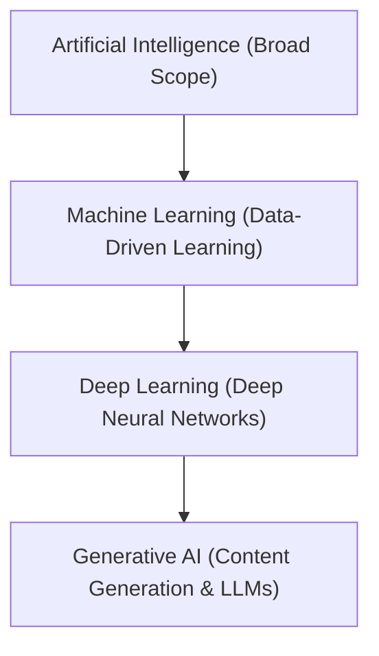

# Day 1 — AI/ML Fundamentals & Development Environment Setup

## 📅 Overview
- **Training Day:** Day 1
- **Phase:** Month 1 — Onboarding & Training Phase
- **Focus Area:** Foundational concepts in AI/ML, engineering workflows, and local development environment setup.

---

## 🎯 Objectives
- Understand the scope and distinctions between Artificial Intelligence (AI), Machine Learning (ML), Deep Learning (DL), and Generative AI (GenAI).
- Understand the role, workflow, and skill expectations of an AI/ML Engineer.
- Configure a robust, reproducible local development environment for data science and AI/ML.
- Initialize version control, GitHub repository structure, and daily reporting mechanisms.

---

## 📋 Assigned Work
1. Study AI/ML foundational definitions and the AI Engineer career roadmap.
2. Verify local installation of Python, Git, Visual Studio Code, and Jupyter Notebook.
3. Configure Git credentials and initialize the remote GitHub repository.
4. Setup daily tracking systems (Google Sheet Tracker and Google Doc Training Log).
5. Document all Day 1 concepts and create an environment verification notebook.

---

## ✅ Completed Work
- [x] Researched and documented foundational differences across AI, ML, DL, and Generative AI.
- [x] Structured the AI/ML learning roadmap and AI Engineer lifecycle.
- [x] Verified local Python (v3.14.3), Git (v2.53.0), and VS Code environment.
- [x] Configured Git user profile (`Shri Sanjaykumar`) and linked the remote GitHub repository.
- [x] Created an interactive Jupyter test notebook (`day1_environment_test.ipynb`) validating the Python environment and basic libraries.
- [x] Established the Day 1 documentation and organized directory structure.

---

## 💡 Key Conceptual Learnings

### 1. Artificial Intelligence (AI)
The broad umbrella domain of computer science dedicated to building systems capable of performing tasks that typically require human intelligence, such as reasoning, problem-solving, perception, and natural language understanding.

### 2. Machine Learning (ML)
A specialized subset of AI that focuses on enabling algorithms to learn patterns and decision rules directly from data, rather than following static, explicitly hardcoded rules. It primarily spans Supervised, Unsupervised, and Reinforcement Learning.

### 3. Deep Learning (DL)
A specialized subset of ML based on multi-layered artificial neural networks inspired by biological neural connections. DL excels at automatically discovering high-level representations from unstructured data (e.g., images, audio, raw text) without manual feature extraction.

### 4. Generative AI (GenAI)
An advanced branch built on deep learning (notably transformer architectures and diffusion models) capable of generating novel, high-quality content—including natural language, synthetic images, code, and audio—moving beyond traditional discriminative/predictive classifications.

### Hierarchy & Relationship

---

## 🛠️ AI/ML Engineer Role & Responsibilities
Through Day 1 onboarding, the key responsibilities and engineering stages of an AI/ML Engineer were identified:
- **Programming & Scripting:** Writing clean, modular Python code for data processing and experimentation.
- **Data Handling & Exploration:** Ingesting, cleaning, validating, and transforming tabular, unstructured, or time-series data.
- **Model Development & Training:** Selecting suitable model architectures, training baselines, and tuning hyperparameters.
- **Evaluation & Validation:** Measuring performance against domain metrics (Accuracy, Precision, Recall, F1, RMSE, ROC-AUC).
- **Experiment Tracking & Reproducibility:** Maintaining consistent documentation, environment dependencies, and random seeds.
- **Version Control & Collaboration:** Using Git branching, commit discipline, and pull requests.
- **Deployment Awareness:** Understanding how trained models are served via REST APIs, containerized, and monitored in production.

---

## ⚙️ Development Environment

| Tool | Purpose | Verified Status |
| :--- | :--- | :--- |
| **Python** | Core runtime for scientific computing & ML | Installed (v3.14.3) |
| **VS Code** | Code editor, debugger, and workspace management | Configured (v1.133.0) |
| **Git** | Distributed version control system | Configured (v2.53.0) |
| **GitHub** | Remote repository hosting and collaboration | Initialized & Linked |
| **Jupyter Notebook** | Interactive notebook for rapid experimentation | Configured & Tested |

---

## 📦 Day 1 Deliverables Summary

| Deliverable | Location | Status |
| :--- | :--- | :--- |
| AI/ML Fundamentals Notes | [`notes/AI-ML-Fundamentals.md`](file:///c:/Users/Priya/Downloads/internship/Day-1/notes/AI-ML-Fundamentals.md) | **Completed** |
| AI/ML Learning Roadmap | [`notes/AI-ML-Roadmap.md`](file:///c:/Users/Priya/Downloads/internship/Day-1/notes/AI-ML-Roadmap.md) | **Completed** |
| AI Engineer Role Guide | [`notes/AI-Engineer-Role.md`](file:///c:/Users/Priya/Downloads/internship/Day-1/notes/AI-Engineer-Role.md) | **Completed** |
| Environment Setup Specs | [`environment/development-environment.md`](file:///c:/Users/Priya/Downloads/internship/Day-1/environment/development-environment.md) | **Completed** |
| Minimal Dependencies | [`environment/requirements.txt`](file:///c:/Users/Priya/Downloads/internship/Day-1/environment/requirements.txt) | **Completed** |
| Environment Test Notebook | [`notebooks/day1_environment_test.ipynb`](file:///c:/Users/Priya/Downloads/internship/Day-1/notebooks/day1_environment_test.ipynb) | **Completed** |
| Evidence Checklist | [`evidence/README.md`](file:///c:/Users/Priya/Downloads/internship/Day-1/evidence/README.md) | **Prepared** |
