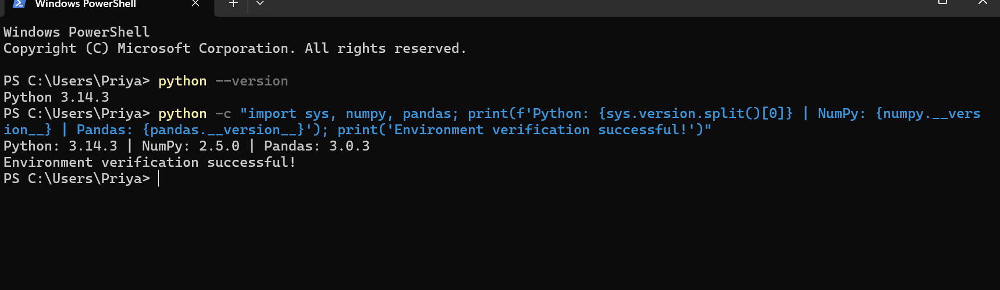
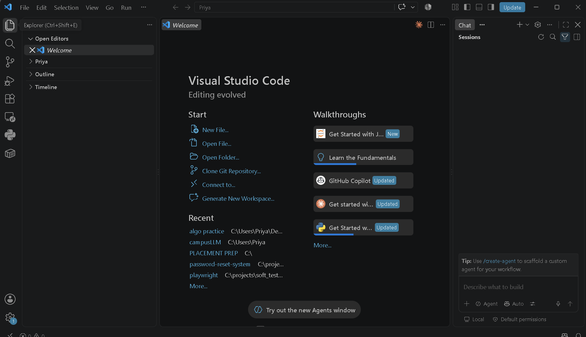
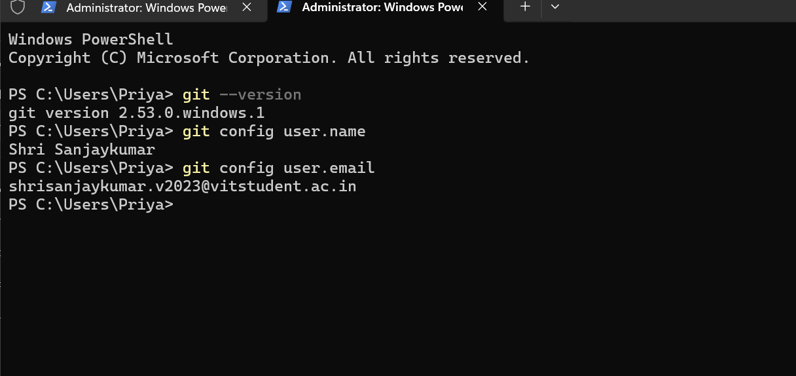

# Day 1 Evidence & Verification Artifacts

This directory contains the visual verification evidence captured for **Day 1 Onboarding & Environment Setup** during the **Linkific AI/ML Internship**.

---

## 📷 Verified Evidence Artifacts

| Verification Area | Evidence File | Description | Status |
| :--- | :--- | :--- | :--- |
| **Python Environment** | [`python.png`](python.png) | Terminal verification of Python version and test execution | **Captured** |
| **VS Code Configuration** | [`vscode.png`](vscode.png) | VS Code workspace configured for Python and AI/ML | **Captured** |
| **Git Configuration** | [`git.png`](git.png) | Git version and user identity configuration | **Captured** |
| **Jupyter Execution** | *Optional / Upcoming* | Interactive execution in test notebook | *Reference notebook in `notebooks/`* |
| **GitHub Repository** | *Upcoming* | Browser view of the remote GitHub repository | *To be captured post-push* |

---

### 1. Python Installation & Test

---

### 2. VS Code Setup

---

### 3. Git Configuration

