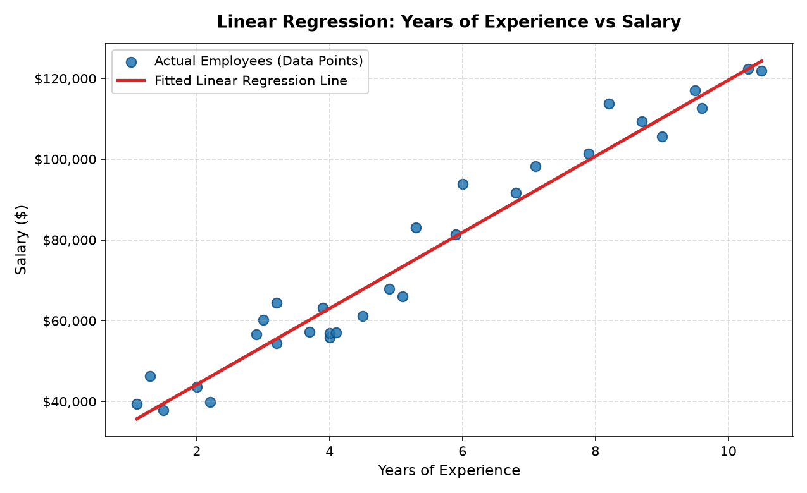

# Day 10 — Machine Learning Practice: Linear Regression

Linkific AI/ML Internship — Month 1 Training

---

## 🎯 Objective

The objective of Day 10 is to understand the fundamental Machine Learning workflow and implement a clean, beginner-friendly **Linear Regression** model using **Scikit-learn**. 

By training an algorithm on a small, intuitive dataset of employee experience and salaries, this project demonstrates how machine learning algorithms discover quantitative associations from historical observations to generate predictions on previously unseen data.

---

## 📊 Dataset

- **Dataset File:** `salary_data.csv`
- **Total Records:** 30 observations
- **Columns:**
  - `YearsExperience`: Number of professional working years (float)
  - `Salary`: Annual salary in USD (integer)
- **Data Quality:** Clean, complete dataset with 0 missing values.

---

## 🔄 Machine Learning Workflow

The project follows a standard 9-step supervised learning pipeline:

```
+---------------------------------------------------------------------------------------+
|  1. Load Data       -->  Ingest CSV dataset into a Pandas DataFrame                   |
|  2. Understand Data -->  Inspect shape (30 rows, 2 cols), types, and 0 missing values |
|  3. Select Features -->  Choose Feature matrix (X) and Target vector (y)              |
|  4. Prepare Data    -->  Verify numerical distributions and summary statistics        |
|  5. Split Data      -->  Partition into 80% Training (24) and 20% Testing (6)        |
|  6. Train Model     -->  Fit LinearRegression() to discover slope and intercept       |
|  7. Make Prediction -->  Apply model.predict() on unseen test records (X_test)        |
|  8. Evaluate        -->  Calculate R² score (~0.9024) and inspect prediction errors    |
|  9. Visualize       -->  Plot scatter observations with the fitted regression line    |
+---------------------------------------------------------------------------------------+
```

---

## ⚙️ Core Components

### 1. Feature ($X$)
- **Attribute:** `YearsExperience`
- **Definition:** The input independent variable used by the model to learn and make predictions.

### 2. Target ($y$)
- **Attribute:** `Salary`
- **Definition:** The continuous quantitative outcome variable the model aims to predict.

### 3. Model
- **Algorithm:** Ordinary Least Squares (OLS) **Linear Regression** via `sklearn.linear_model.LinearRegression`.
- **Mathematical Form:**
  $$\hat{y} = mx + b$$
  Where:
  - $\hat{y}$ = Predicted Salary
  - $x$ = Years of Experience
  - $m$ = Slope (Coefficient representing salary increase per additional year of experience)
  - $b$ = Intercept (Estimated starting salary with zero years of experience)

### 4. Train / Test Split
- **Training Set:** 80% of records (24 samples) used by `model.fit()` to learn parameters.
- **Testing Set:** 20% of records (6 samples) withheld during training to evaluate how well the model generalizes to new data.
- **Reproducibility:** `random_state=42` ensures identical, deterministic data splitting across executions.

---

## 📈 Predictions and Evaluation

### How Predictions are Made
All predictions are calculated programmatically using:
```python
y_pred = model.predict(X_test)
```
No prediction values are hardcoded or manually entered.

### Learned Model Parameters
- **Slope ($m$):** $\approx \$9,423.82$ per year of experience.
- **Intercept ($b$):** $\approx \$25,321.58$ base baseline salary.
- **Learned Formula:**
  $$\text{Salary} = (\$9,423.82 \times \text{YearsExperience}) + \$25,321.58$$

### Evaluation Metric ($R^2$ Score)
- **$R^2$ Score:** $\approx 0.9024$ ($90.2\%$ of salary variation is explained by years of experience).
- **Residual Errors:** Predicted salaries closely match actual employee compensation across the test set.

---

## 📉 Visualization

The pipeline creates a clear scatter plot of actual observations paired with the fitted regression line (`regression_plot.png`):
- **Blue Points:** Actual employee records ($N = 30$).
- **Red Line:** The best-fit linear regression trajectory learned by the model.



---

## ⚠️ Model Limitations & Statistical Disclaimer

> **Important Limitation:**
> This is a beginner Linear Regression practice model using a single feature (`YearsExperience`). In real-world organizations, compensation depends on many factors such as department, role seniority, educational background, company scale, and location.
>
> Therefore, this model is intended to demonstrate the basic ML workflow rather than provide a complete salary prediction system.
>
> Furthermore, the model establishes a **statistical association** between experience and salary—it does not claim that years of experience alone are the sole cause of salary differences.

---

## 📁 Repository Structure

```
Day-10/
├── salary_data.csv      # Clean small dataset (30 rows × 2 columns)
├── ml_practice.ipynb    # 19-section interactive Jupyter notebook with outputs
├── ml_practice.py       # Standalone executable Python script
├── regression_plot.png  # Generated high-resolution regression chart
└── README.md            # Comprehensive project documentation
```

---

## 🚀 How to Run

### Run the Python Script:
```bash
python Day-10/ml_practice.py
```

### Run the Notebook:
Open `Day-10/ml_practice.ipynb` in VS Code or Jupyter to inspect and run all 19 sections sequentially.
