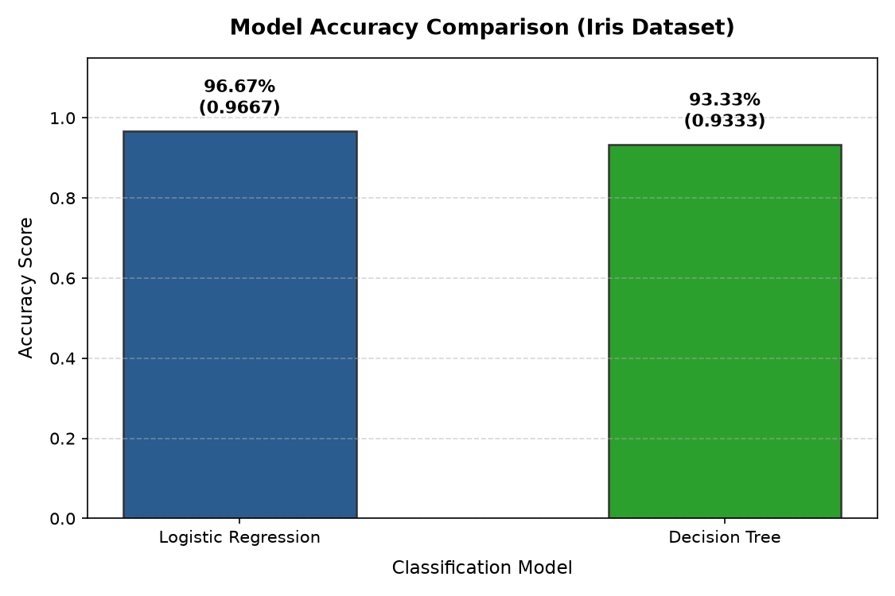
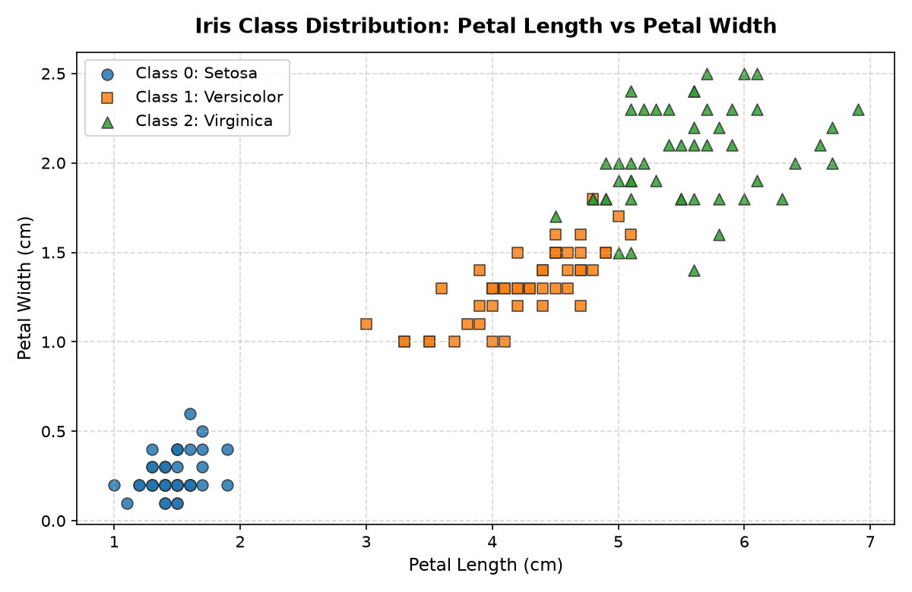

# Day 11 — Classification Machine Learning

Linkific AI/ML Internship — Month 1 Training

---

## 🎯 Objective

The objective of Day 11 is to introduce foundational **Classification** concepts in Supervised Machine Learning. Unlike regression (which predicts continuous numerical values), classification predicts discrete category labels. 

On Day 11, we trained and compared two classic, beginner-friendly classification algorithms—**Logistic Regression** and **Decision Tree**—on the benchmark **Iris dataset**, evaluating their generalization performance using **Accuracy**.

---

## 📊 Dataset

- **Source:** Scikit-learn built-in dataset (`sklearn.datasets.load_iris`).
- **Sample Size:** 150 total flower samples.
- **Input Features (4 continuous measurements):**
  1. `sepal length (cm)`
  2. `sepal width (cm)`
  3. `petal length (cm)`
  4. `petal width (cm)`
- **Target Classes (3 Iris species):**
  - Class 0: `setosa` (50 samples)
  - Class 1: `versicolor` (50 samples)
  - Class 2: `virginica` (50 samples)
- **Data Quality:** Perfectly balanced classes (50 samples each) with 0 missing values.

---

## 🤖 Models Used

### 1. Logistic Regression
- **What it is:** A linear classification model that estimates the probability that an observation belongs to a particular class using the logistic (sigmoid/softmax) function.
- **How it works:** It learns linear decision boundaries across feature space to separate classes.
- **Configuration:** `LogisticRegression(max_iter=200)` to ensure complete convergence.

### 2. Decision Tree
- **What it is:** A non-linear, tree-structured classifier that breaks down a dataset into smaller subsets while an associated decision tree is incrementally developed.
- **How it works:** It makes a sequence of simple "if-else" threshold decisions based on feature values to partition the data.
- **Configuration:** `DecisionTreeClassifier(random_state=42)` for deterministic, reproducible tree splits.

---

## 🔄 Workflow

Both models were trained and tested on the exact same stratified 80/20 train-test split (`random_state=42`, `stratify=y`), producing 120 training samples and 30 testing samples (10 per species) to guarantee a completely fair comparison:

```text
                  +-------------------------------------------------+
                  |              Iris Dataset (150 rows)            |
                  +-------------------------------------------------+
                                           |
                                           v
                  +-------------------------------------------------+
                  |     Feature (X: 4 cols) & Target (y: species)   |
                  +-------------------------------------------------+
                                           |
                                           v
                  +-------------------------------------------------+
                  |      80/20 Train-Test Split (stratify=y)        |
                  |     120 Training Samples | 30 Testing Samples   |
                  +-------------------------------------------------+
                         /                                    \
                        /                                      \
                       v                                        v
+--------------------------------------+  +--------------------------------------+
|       Logistic Regression            |  |             Decision Tree            |
|   - model.fit(X_train, y_train)      |  |   - model.fit(X_train, y_train)      |
|   - y_pred = model.predict(X_test)   |  |   - y_pred = model.predict(X_test)   |
|   - accuracy = accuracy_score()      |  |   - accuracy = accuracy_score()      |
+--------------------------------------+  +--------------------------------------+
                       \                                        /
                        \                                      /
                         v                                    v
                  +-------------------------------------------------+
                  |     Model Comparison & Performance Evaluation   |
                  +-------------------------------------------------+
```

---

## 📈 Accuracy Comparison

Model accuracy is calculated as:
$$\text{Accuracy} = \frac{\text{Number of Correct Predictions}}{\text{Total Predictions}}$$

### Execution Results on Held-Out Test Set ($N = 30$):

| Model | Correct Predictions | Accuracy | Accuracy (%) |
| :--- | :---: | :---: | :---: |
| **Logistic Regression** | **29 / 30** | **0.9667** | **96.67%** |
| **Decision Tree** | **28 / 30** | **0.9333** | **93.33%** |

- **Better Performing Model:** **Logistic Regression**
- **Accuracy Difference:** **0.0333 (3.33%)** — a margin of 1 additional correct prediction on this test set.

---

## 📉 Visualizations

### 1. Model Accuracy Comparison Bar Chart


### 2. Iris Class Distribution (Petal Length vs. Petal Width)


---

## 📝 Observations

1. **Both Models Performed Strongly:** Both Logistic Regression (96.67%) and Decision Tree (93.33%) achieved high test accuracy, confirming that the Iris dataset has well-separated, informative features.
2. **Smooth Boundary Advantage:** The Iris classes exhibit strong linear separability (especially Setosa vs. other species). Logistic Regression's smooth probabilistic boundaries generalized slightly better than Decision Tree's orthogonal axis splits on this test split.
3. **Identical Splitting is Essential:** Evaluating both models on the exact same stratified test samples ensured that the 3.33% accuracy difference was strictly attributable to model architecture rather than sample variation.
4. **Dataset Sensitivity:** In machine learning, model performance is context-dependent—a model that wins on one dataset or split may perform differently on another.

---

## 📁 Files Created

- `classification_practice.ipynb`: Interactive 19-section Jupyter notebook with code, Markdown explanations, and embedded outputs.
- `classification_practice.py`: Standalone executable Python runner script.
- `model_accuracy_comparison.png`: Bar chart comparing model accuracy scores.
- `iris_class_distribution.png`: Scatter plot visualizing Iris species distributions across petal dimensions.
- `README.md`: Complete project documentation and concept guide.

---

## 💡 What Was Learned

- What classification is and how it differs fundamentally from regression.
- How to load and inspect benchmark datasets using Scikit-learn.
- How to apply stratified train-test splitting to maintain class proportions.
- How to instantiate, train (`.fit()`), and generate predictions (`.predict()`) with Logistic Regression and Decision Trees.
- How to evaluate and compare classifiers using accuracy and visualize the comparison cleanly.
