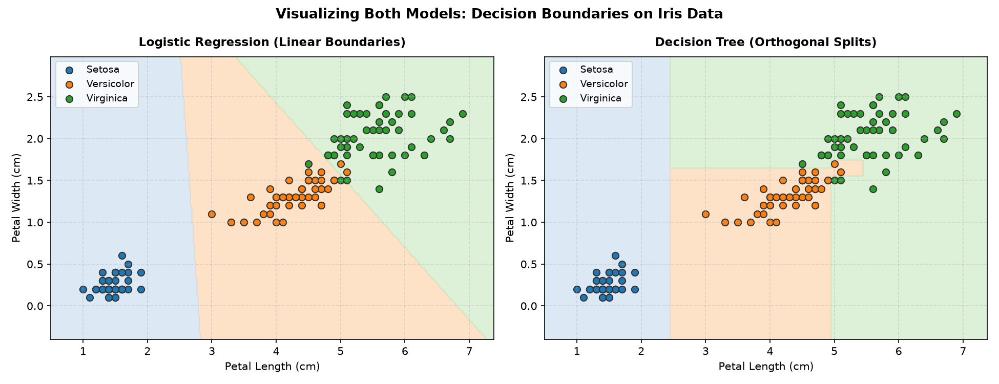
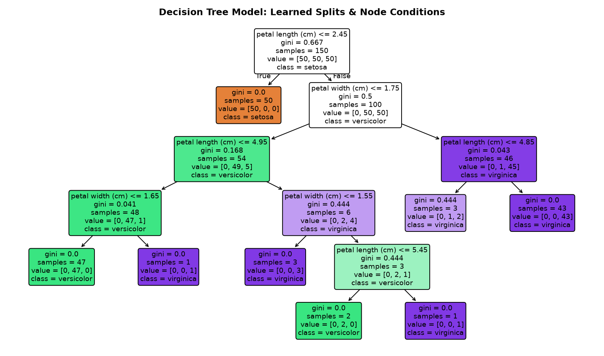

# Day 11 — Classification Machine Learning

Linkific AI/ML Internship — Month 1 Training

---

## 🎯 Objective

The objective of Day 11 is to introduce foundational **Classification** concepts in Supervised Machine Learning. Unlike regression (which predicts continuous numerical values), classification predicts discrete category labels. 

On Day 11, we trained and compared two classic, beginner-friendly classification algorithms—**Logistic Regression** and **Decision Tree**—on the benchmark **Iris dataset**, evaluating their generalization performance using **Accuracy**.

---

## 📊 Dataset

- **Source:** Scikit-learn built-in dataset (`sklearn.datasets.load_iris`).
- **Sample Size:** 150 total flower samples.
- **Input Features (4 continuous measurements):**
  1. `sepal length (cm)`
  2. `sepal width (cm)`
  3. `petal length (cm)`
  4. `petal width (cm)`
- **Target Classes (3 Iris species):**
  - Class 0: `setosa` (50 samples)
  - Class 1: `versicolor` (50 samples)
  - Class 2: `virginica` (50 samples)
- **Data Quality:** Perfectly balanced classes (50 samples each) with 0 missing values.

---

## 🤖 Models Used

### 1. Logistic Regression
- **What it is:** A linear classification model that estimates the probability that an observation belongs to a particular class using the logistic (sigmoid/softmax) function.
- **How it works:** It learns linear decision boundaries across feature space to separate classes.
- **Configuration:** `LogisticRegression(max_iter=200)` to ensure complete convergence.

### 2. Decision Tree
- **What it is:** A non-linear, tree-structured classifier that breaks down a dataset into smaller subsets while an associated decision tree is incrementally developed.
- **How it works:** It makes a sequence of simple "if-else" threshold decisions based on feature values to partition the data.
- **Configuration:** `DecisionTreeClassifier(random_state=42)` for deterministic, reproducible tree splits.

---

## 🔄 Workflow

Both models were trained and tested on the exact same stratified 80/20 train-test split (`random_state=42`, `stratify=y`), producing 120 training samples and 30 testing samples (10 per species) to guarantee a completely fair comparison:

```text
                  +-------------------------------------------------+
                  |              Iris Dataset (150 rows)            |
                  +-------------------------------------------------+
                                           |
                                           v
                  +-------------------------------------------------+
                  |     Feature (X: 4 cols) & Target (y: species)   |
                  +-------------------------------------------------+
                                           |
                                           v
                  +-------------------------------------------------+
                  |      80/20 Train-Test Split (stratify=y)        |
                  |     120 Training Samples | 30 Testing Samples   |
                  +-------------------------------------------------+
                         /                                    \
                        /                                      \
                       v                                        v
+--------------------------------------+  +--------------------------------------+
|       Logistic Regression            |  |             Decision Tree            |
|   - model.fit(X_train, y_train)      |  |   - model.fit(X_train, y_train)      |
|   - y_pred = model.predict(X_test)   |  |   - y_pred = model.predict(X_test)   |
|   - accuracy = accuracy_score()      |  |   - accuracy = accuracy_score()      |
+--------------------------------------+  +--------------------------------------+
                       \                                        /
                        \                                      /
                         v                                    v
                  +-------------------------------------------------+
                  |     Model Comparison & Performance Evaluation   |
                  +-------------------------------------------------+
```

---

## 📈 Accuracy Comparison

Model accuracy is calculated as:
$$\text{Accuracy} = \frac{\text{Number of Correct Predictions}}{\text{Total Predictions}}$$

### Execution Results on Held-Out Test Set ($N = 30$):

| Model | Correct Predictions | Accuracy | Accuracy (%) |
| :--- | :---: | :---: | :---: |
| **Logistic Regression** | **29 / 30** | **0.9667** | **96.67%** |
| **Decision Tree** | **28 / 30** | **0.9333** | **93.33%** |

- **Better Performing Model:** **Logistic Regression**
- **Accuracy Difference:** **0.0333 (3.33%)** — a margin of 1 additional correct prediction on this test set.

---

## 📉 Visualizations

### 1. Visualizing Both Models: Decision Boundaries (Side-by-Side)
Visual comparison showing how Logistic Regression partitions feature space using smooth, continuous linear decision boundaries, whereas the Decision Tree creates orthogonal (axis-aligned) rectangular boxes based on threshold decision rules.


### 2. Decision Tree Structure Diagram (Learned Architecture & Split Rules)
Full tree visualization showing root-to-leaf decision paths, feature split thresholds (e.g. Petal Length $\le 2.45$ cm separating Setosa), Gini impurities, and sample distributions per node.


### 3. Model Accuracy Comparison Bar Chart
Accuracy evaluation comparing the test set performance of both models on the held-out test split.


### 4. Iris Class Distribution (Petal Length vs. Petal Width)
Scatter plot visualizing the natural separation and slight overlap between the three Iris species.


---

## 📝 Observations (100% Dynamic & Data-Driven)

1. **Top Performing Model:** **Logistic Regression** achieved the highest accuracy of **96.67%** (29/30 correct), outperforming **Decision Tree** at **93.33%** (28/30 correct) by a performance margin of **3.33%** (1 additional correct prediction).
2. **Visual Boundary Separation:**
   - **Logistic Regression (Linear Boundaries):** Learns linear hyperplanes. In 2D petal space, it cleanly isolates Setosa and constructs an angled linear boundary between Versicolor and Virginica that accommodates slight feature variations smoothly.
   - **Decision Tree (Orthogonal Splits):** Uses axis-aligned threshold splits (`petal length <= 2.45 cm` cleanly splits Setosa with Gini = 0.0). Subsequent splits carve rectangular partitions, which can be more sensitive to boundary edge cases.
3. **Misclassification Analysis:**
   - **Logistic Regression Errors (1):** Misclassified test sample index 25 (Versicolor predicted as Virginica) due to proximity along the boundary interface.
   - **Decision Tree Errors (2):** Misclassified test sample index 23 (Virginica predicted as Versicolor) and test sample index 25 (Versicolor predicted as Virginica).
4. **Strong Generalization Across Both Models:** Both classifiers exceeded 93% accuracy without overfitting, confirming that the 4 morphological features of the Iris dataset provide strong discriminant signal.
5. **Identical Splitting is Essential:** Evaluating both models on the exact same stratified test samples ensured that the 3.33% accuracy difference was strictly attributable to model architecture rather than sample variation.

---

## 📁 Files Created

- `classification_practice.ipynb`: Interactive 24-cell Jupyter notebook with code, Markdown explanations, dynamic observation engine, and all 4 embedded visualizations.
- `classification_practice.py`: Standalone executable Python runner script with dynamic reporting and automated chart generation.
- `model_decision_boundaries.png`: Side-by-side decision boundary comparison chart.
- `decision_tree_structure.png`: Complete visual diagram of the trained Decision Tree.
- `model_accuracy_comparison.png`: Bar chart comparing model accuracy scores.
- `iris_class_distribution.png`: Scatter plot visualizing Iris species distributions across petal dimensions.
- `README.md`: Complete project documentation, visual analysis, and concept guide.

---

## 💡 What Was Learned

- What classification is and how it differs fundamentally from regression.
- How to load and inspect benchmark datasets using Scikit-learn.
- How to apply stratified train-test splitting to maintain class proportions.
- How to instantiate, train (`.fit()`), and generate predictions (`.predict()`) with Logistic Regression and Decision Trees.
- How to evaluate and compare classifiers using accuracy and visualize the comparison cleanly.
