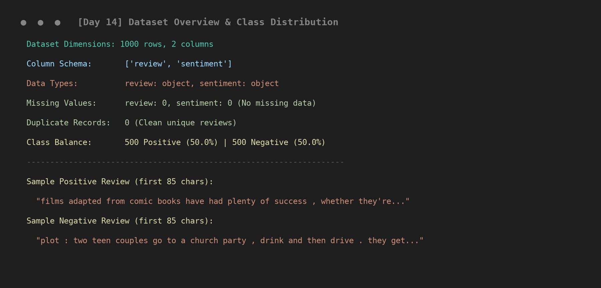
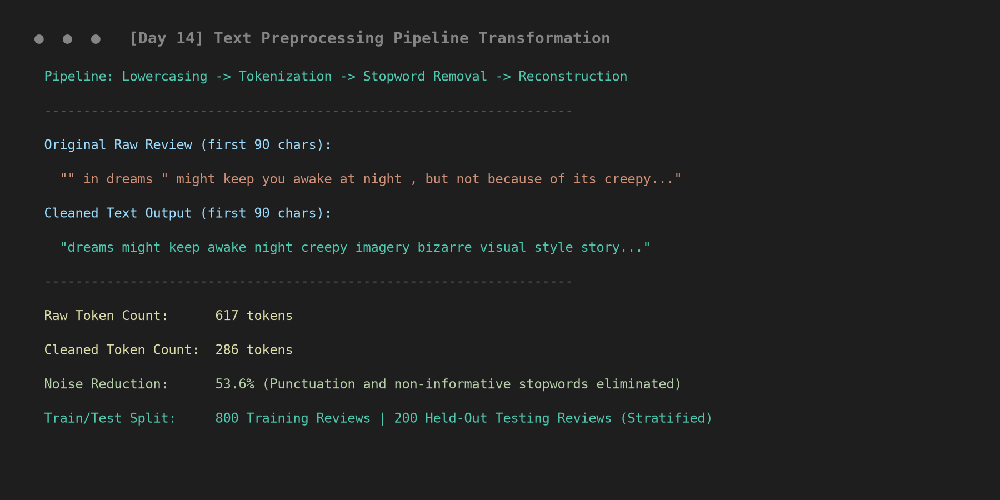
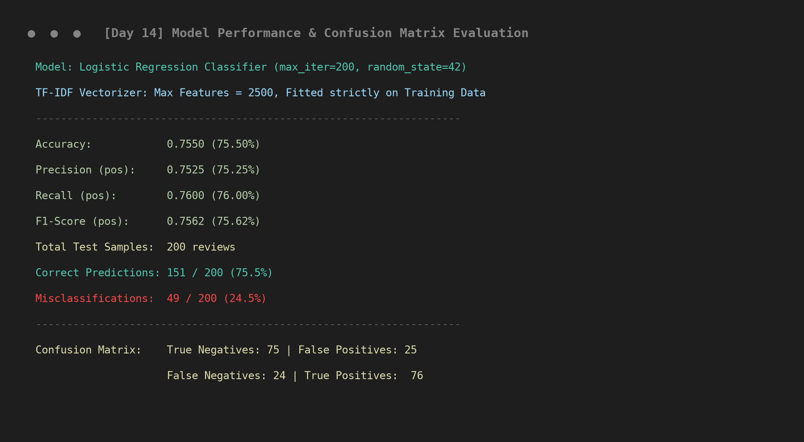
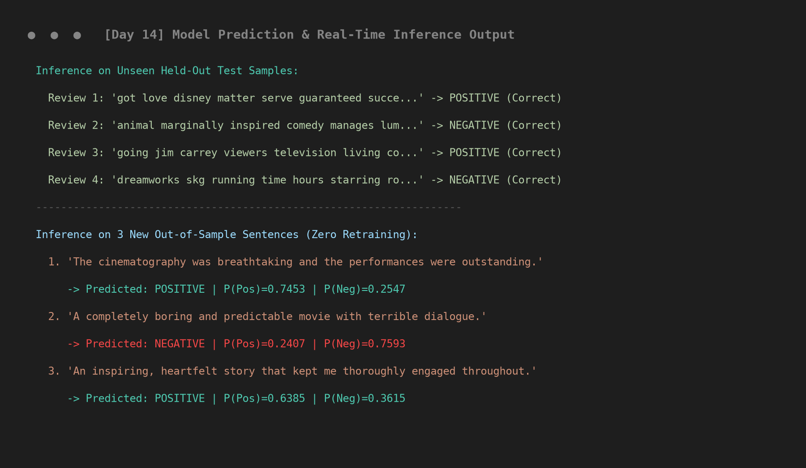

# Project Screenshots — Day 14: Basic Sentiment Analysis

This directory contains visual captures from the executed machine learning pipeline and evaluation outputs.

---

## 1. Dataset Overview & Class Distribution

*Displays dataset dimensions (1,000 rows × 2 columns), column schema, null checks, duplicate checks, balanced class proportions (500 positive, 500 negative), and sample raw text reviews.*

---

## 2. Text Preprocessing Pipeline Transformation

*Demonstrates the 4-stage NLP cleaning pipeline (Lowercasing, Tokenization, Stopword Removal, Clean Text Reconstruction) resulting in a 53.6% reduction in non-informative noise tokens.*

---

## 3. Model Performance & Confusion Matrix Evaluation

*Summarizes test metrics on 200 held-out reviews (75.50% Accuracy, 75.25% Precision, 76.00% Recall, 75.62% F1-Score) and confusion matrix breakdown (76 True Positives, 75 True Negatives, 25 False Positives, 24 False Negatives).*

---

## 4. Model Prediction & Out-of-Sample Inference Output

*Shows sample predictions on unseen test reviews and real-time inference on 3 new out-of-sample sentences using the fitted pipeline without retraining.*
