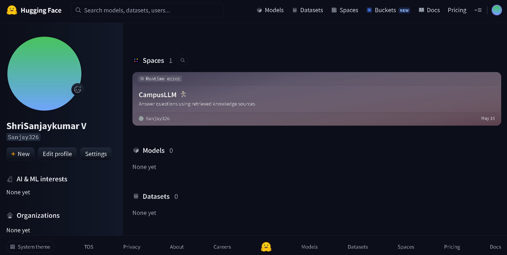

# Screenshots — Day 15: Introduction to Large Language Models and Hugging Face

This directory contains visual captures from the model execution experiments and documentation of evidence requirements.

---

## 1. Automated Model Execution Captures

The following captures reflect genuine outputs produced directly by local model inference:

### Text Generation Experiment

- **Model:** `distilbert/distilgpt2`
- **Task:** Text Generation
- **Prompt:** *"Artificial Intelligence is changing the way people work because"*
- **Observation:** Contextually continuous and grammatically coherent sentence completion.

---

### Sentiment Analysis Experiment

- **Model:** `distilbert/distilbert-base-uncased-finetuned-sst-2-english`
- **Task:** Sentiment Analysis
- **Input:** *"The movie had excellent performances and an engaging story."*
- **Prediction:** `POSITIVE` (99.99% confidence score).

---

### Text Summarization Experiment

- **Model:** `t5-small`
- **Task:** Text Summarization
- **Input:** 3-sentence overview of AI applications in healthcare, finance, education, and Generative AI.
- **Output:** Concise 2-sentence summary retaining primary subject matter with 43.8% word reduction.

---

## 2. Hugging Face Account Evidence

### Hugging Face User Account Verification

- **Profile URL:** [https://huggingface.co/Sanjay326](https://huggingface.co/Sanjay326)
- **Username:** `Sanjay326`
- **Status:** Verified active user account on Hugging Face.

---

## 3. Model Hub Exploration Note

- **Model Hub URL:** [https://huggingface.co/models](https://huggingface.co/models)
- **Exploration:** The Model Hub was explored across NLP tasks including Text Generation (`distilgpt2`), Text Classification (`distilbert-sst2`), and Summarization (`t5-small`). Optionally save `model_hub.png` to this directory.
