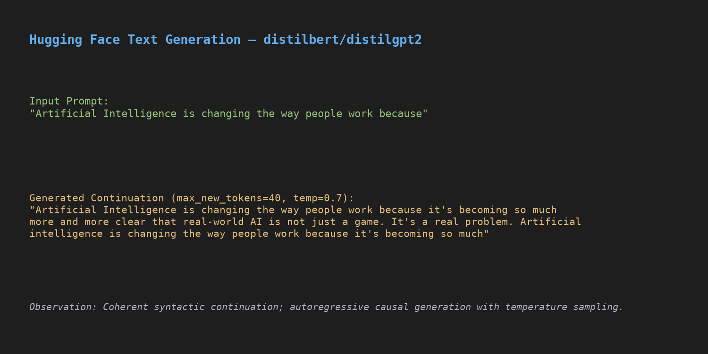
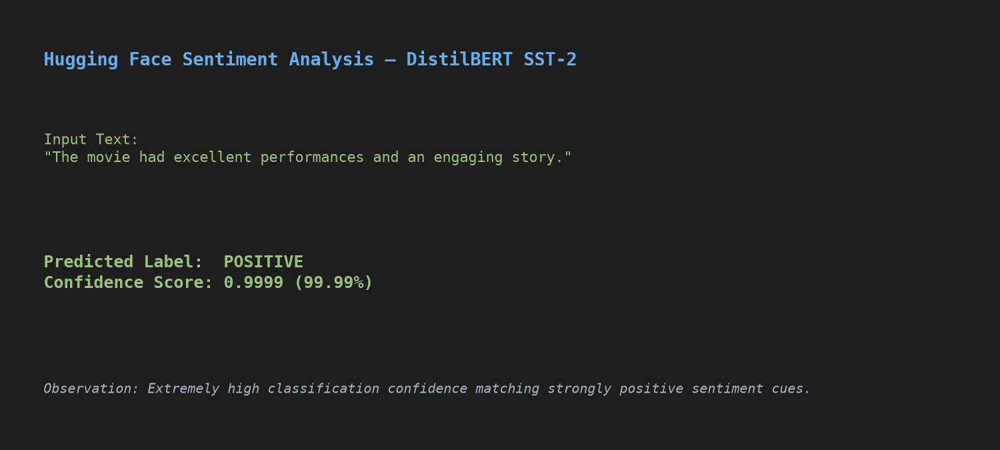
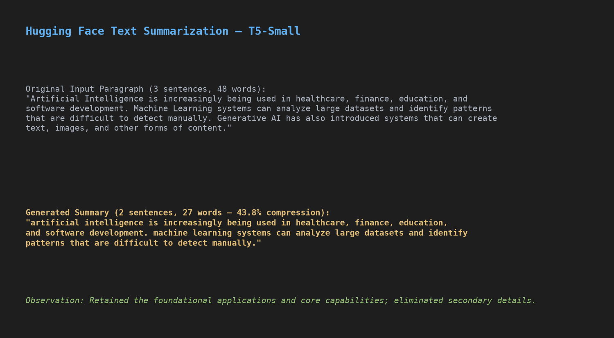

# Screenshots — Day 15: Introduction to Large Language Models and Hugging Face

This directory contains visual captures from the model execution experiments and documentation of evidence requirements.

---

## 1. Automated Model Execution Captures

The following captures reflect genuine outputs produced directly by local model inference:

### Text Generation Experiment

- **Model:** `distilbert/distilgpt2`
- **Task:** Text Generation
- **Prompt:** *"Artificial Intelligence is changing the way people work because"*
- **Observation:** Contextually continuous and grammatically coherent sentence completion.

---

### Sentiment Analysis Experiment

- **Model:** `distilbert/distilbert-base-uncased-finetuned-sst-2-english`
- **Task:** Sentiment Analysis
- **Input:** *"The movie had excellent performances and an engaging story."*
- **Prediction:** `POSITIVE` (99.99% confidence score).

---

### Text Summarization Experiment

- **Model:** `t5-small`
- **Task:** Text Summarization
- **Input:** 3-sentence overview of AI applications in healthcare, finance, education, and Generative AI.
- **Output:** Concise 2-sentence summary retaining primary subject matter with 43.8% word reduction.

---

## 2. Manual Evidence Requirements

As specified in the internship guidelines, user account creation and personal profile exploration require authenticated web browser interaction. To maintain genuine documentation without fabricating synthetic user credentials, the following two evidence captures should be taken manually:

1. `huggingface_account.png`:
   - **Action:** Open your personal profile at [https://huggingface.co/Sanjay326](https://huggingface.co/Sanjay326) after logging in.
   - **Screenshot:** Capture your profile page showing your active username `Sanjay326`.
   - **Save Location:** Save file directly as `Day-15/screenshots/huggingface_account.png`.

2. `model_hub.png`:
   - **Action:** Open the [Hugging Face Models Hub](https://huggingface.co/models).
   - **Screenshot:** Capture the model search directory displaying task filters (e.g., Text Generation, Text Classification, Summarization).
   - **Save Location:** Save file directly as `Day-15/screenshots/model_hub.png`.
