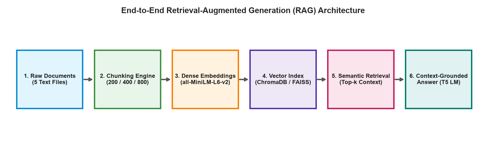
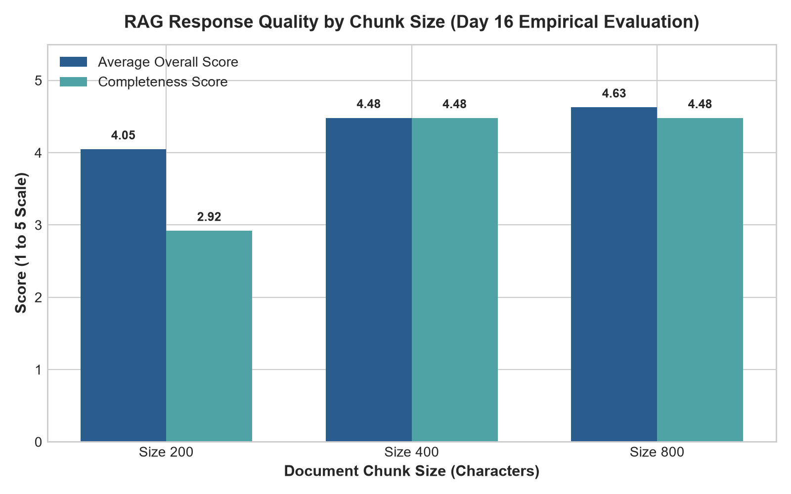
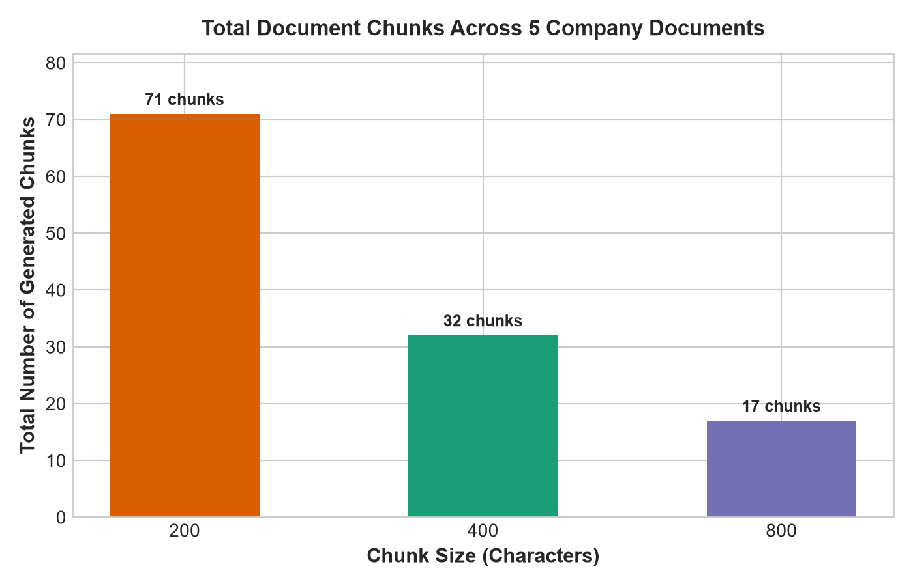
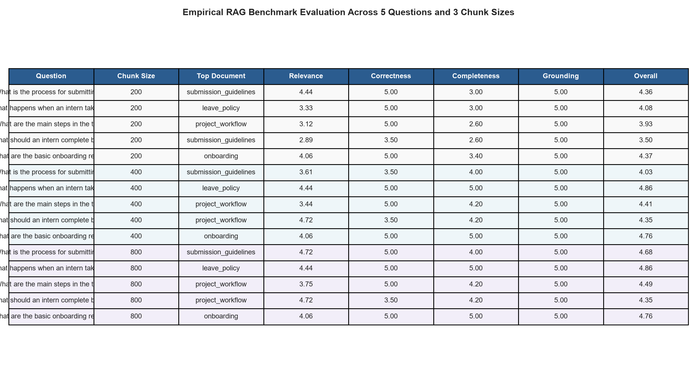

# Screenshots & Visual Evidence — Day 16: Basic RAG Pipeline

This directory contains visual execution evidence, architectural diagrams, and experimental evaluation charts generated during the Day 16 Retrieval-Augmented Generation (RAG) experiments.

---

## 1. RAG System Architecture Workflow

- **Description:** Illustrates the complete 6-stage engineering lifecycle of the implemented RAG pipeline:
  1. Synthetic Company Documents (5 demonstration text files)
  2. Character Chunking (200, 400, and 800-character windows with overlap)
  3. Dense Vector Embeddings (`sentence-transformers/all-MiniLM-L6-v2`, 384 dimensions)
  4. Vector Database Indexing (ChromaDB collection & FAISS index)
  5. Semantic Retrieval (Cosine similarity / L2 distance ranking)
  6. Context-Grounded Answer Generation (T5 Seq2Seq LM conditioned on retrieved context)

---

## 2. Chunk Size Performance Comparison

- **Description:** Comparative evaluation of Overall Score and Completeness Score across the three tested chunk sizes (200, 400, and 800 characters).
- **Key Finding:** For this demonstration dataset and evaluation set, Chunk Size 800 achieved the highest overall score (**4.63 / 5.00**) and highest relevance (**4.34 / 5.00**), providing the best observed balance between retrieval relevance and response completeness without fragmenting procedural instructions. Chunk Size 400 scored **4.48 / 5.00**, while Chunk Size 200 scored **4.05 / 5.00** due to procedural list fragmentation.

---

## 3. Total Chunks Generated Across Corpus

- **Description:** Distribution of total chunks generated from the 10,657-character demonstration corpus:
  - **Chunk Size 200 (overlap 50):** 71 chunks
  - **Chunk Size 400 (overlap 50):** 32 chunks
  - **Chunk Size 800 (overlap 100):** 17 chunks

---

## 4. Response Evaluation Matrix

- **Description:** Summary table of benchmark evaluation questions, retrieved document sources, generated answers, and objective evaluation scores across the tested chunk configurations.
