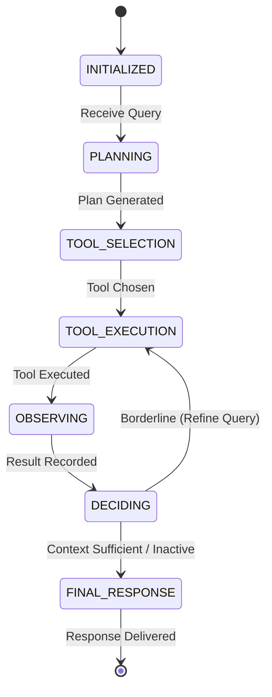

# AI Agent System Design Document
**Document Research Assistant Agent**  
*Proposed AI Agent Architecture for Integration into Company Project*

---

| Attribute | Specification |
| :--- | :--- |
| **Intern Name** | Shri Sanjaykumar V |
| **Role** | AI/ML Intern, Linkific |
| **Project** | Linkific AI/ML Internship Training — Day 18 |
| **Domain** | AI Agent Fundamentals, ReAct-Inspired Architecture, Tool Calling |
| **Date** | September 2026 |
| **Document Version** | 1.0 (Enterprise Specification) |
| **Confidentiality** | Strict Confidentiality Maintained (100% Synthetic Data) |

---

## 1. Executive Summary
Modern enterprise operations generate vast repositories of documentation spanning human resource guidelines, employee onboarding manuals, software engineering standards, and training syllabi. Static search engines and conventional keyword lookups often overwhelm users with fragmented excerpts, requiring significant manual effort to assemble coherent, actionable answers. 

This document defines the architectural specification and implementation design for the **Document Research Assistant Agent**—a goal-directed AI Agent prototype built from first principles in Python 3.13. Designed as a proposed agentic subsystem for integration into the Linkific company project, this agent operationalizes the **ReAct (Reason + Act)** paradigm. Rather than executing a rigid, linear retrieval pipeline, the agent continuously perceives user intent, formulates a multi-step execution plan, selects and invokes targeted retrieval tools, observes structured environment feedback, evaluates information sufficiency, and synthesizes grounded, factually verifiable responses backed by rigorous source attribution.

---

## 2. System Overview
The Document Research Assistant Agent serves as an intelligent intermediary between end-users (such as incoming interns, software engineers, and administrative personnel) and internal organizational knowledge bases. 

### Key Capabilities
1. **Autonomous Goal Analysis:** Interrogates user queries to deduce core task intent rather than executing blind searches.
2. **Deterministic Step-by-Step Planning:** Decomposes queries into explicit, ordered plan steps before triggering external actions.
3. **Discrete Tool Usage:** Interacts with external systems exclusively through well-defined, schema-validated tools (`document_search`, `document_lookup`, `document_metadata`, `final_response`).
4. **Structured ReAct Loop:** Executes an explicit `PLAN` $\rightarrow$ `ACT` $\rightarrow$ `OBSERVE` $\rightarrow$ `DECIDE` $\rightarrow$ `FINAL` loop with complete auditability.
5. **Anti-Hallucination Guardrails:** Enforces strict grounding rules where every claim must be backed by retrieved context; returns controlled refusals for out-of-domain inquiries.

---

## 3. Proposed Architecture for Company Project Integration
Within the broader Linkific engineering ecosystem, this agent is designed to integrate seamlessly as an intelligent orchestration layer directly above existing document ingestion and vector retrieval services developed in prior training milestones:
- **Day 16 Foundation:** Leverages concepts of semantic chunking, embedding generation, and vector retrieval.
- **Day 17 Foundation:** Integrates upstream with FastAPI endpoints, multipart document ingestion pipelines, and structured schemas.
- **Day 18 Agent Innovation:** Replaces static RAG with dynamic reasoning, tool-directed investigation, query refinement, and autonomous decision-making.

```
[User / Client Application]
          │
          ▼
┌────────────────────────────────────────────────────────┐
│  Linkific FastAPI Ingestion & Serving Layer (Day 17)   │
└─────────────────────────┬──────────────────────────────┘
                          │
                          ▼
┌────────────────────────────────────────────────────────┐
│   Document Research Assistant Agent Core (Day 18)      │
│   - State Machine: INITIALIZED -> PLANNING -> ACT ...  │
│   - Short-Term Working Memory (AgentMemory)           │
│   - Planning & Reasoning Engine (ReAct Cycle)         │
└──────┬──────────────────┬──────────────────┬───────────┘
       │                  │                  │
       ▼                  ▼                  ▼
┌──────────────┐   ┌──────────────┐   ┌──────────────┐
│document_     │   │document_     │   │document_     │
│search        │   │lookup        │   │metadata      │
└──────┬───────┘   └──────┬───────┘   └──────┬───────┘
       │                  │                  │
       └──────────────────┼──────────────────┘
                          │
                          ▼
┌────────────────────────────────────────────────────────┐
│    Synthetic Enterprise Knowledge Base (Day 18 Data)   │
│    - DOC-LEAVE-001: Leave & Working Hours Policy       │
│    - DOC-ONBOARD-002: Technical Environment Setup     │
│    - DOC-TRAIN-003: Curriculum & Submission Guidelines │
│    - DOC-WORKFLOW-004: ML Project Lifecycle & QA       │
└────────────────────────────────────────────────────────┘
```

---

## 4. Business Problem & Value Proposition
### The Business Challenge
In fast-paced technical organizations, engineering interns and staff lose up to 25% of productive time locating standard operating procedures, deciphering onboarding prerequisites, checking submission deadlines, and clarifying leave policies across disjointed documentation.

### Value Delivered
- **Immediate Contextual Answers:** Condenses multi-page manuals into exact, sentence-level factual responses within milliseconds.
- **Hallucination Mitigation:** By grounding answers in retrieved documentation and returning controlled no-information responses, the system is designed to reduce unsupported statements.
- **Transparent Auditability:** Every recommendation is linked to a document title, document ID, and verifiable execution trace.
- **Operational Scalability:** Relieves senior mentors, project managers, and HR coordinators from answering repetitive policy inquiries.

---

## 5. Agent Persona & Operational Boundaries
### Persona Profile
- **Role:** Professional Document Research Assistant
- **Tone:** Objective, formal, concise, and helpful.
- **Primary Objective:** Provide grounded, verifiable answers to operational, policy, onboarding, and workflow questions.

### Operational Boundaries
- **In-Scope:** Internal company policies, working hours, leave application procedures, IDE setup, repository access, training schedules, daily milestone submission rules, and machine learning quality assurance workflows.
- **Out-of-Scope:** External financial markets, company stock prices, cryptocurrency trading, weather forecasts, celebrity trivia, and non-operational personal advice.
- **Boundary Behavior:** When confronted with out-of-scope topics, the agent must immediately execute a controlled refusal without calling retrieval tools or hallucinating data.

---

## 6. Architectural Layers
The agent system is structured into five strictly separated layers:

### Layer 1: Presentation & Client Layer
Accepts user input from CLI runners, automated test fixtures, or external REST clients, sanitizing strings and initiating execution.

### Layer 2: Agent Core & Orchestration Layer
Encapsulated by `DocumentResearchAgent`, managing agent state transitions (`AgentState`), short-term working memory (`AgentMemory`), and execution timeouts.

### Layer 3: Planning & Reasoning Layer
Encapsulated by `Planner`, which analyzes query semantics, filters stop-words, identifies high-level intents (`document_search`, `document_lookup`, `document_metadata`, `unsupported_domain`), and constructs ordered execution plans.

### Layer 4: Tool Execution & Dispatch Layer
Encapsulated by `ToolRegistry`, providing safe execution wrappers around four specialized tools, trapping runtime exceptions and returning standardized `ToolResult` objects.

### Layer 5: Knowledge Base & Storage Layer
Encapsulated by `KnowledgeBaseLoader`, providing cached access, metadata extraction, and semantic chunk indexing across synthetic enterprise files.

---

## 7. State Machine Specification
The agent transitions across eight well-defined states:


| State | Description | Invariant |
| :--- | :--- | :--- |
| `INITIALIZED` | Agent instantiated; memory cleared. | No prior state leakage. |
| `PLANNING` | Query intent analyzed; steps generated. | Plan must contain >= 1 step. |
| `TOOL_SELECTION` | Target tool mapped to planned step. | Tool must exist in `ToolRegistry`. |
| `TOOL_EXECUTION` | Tool executed with JSON arguments. | Tool call captured in audit trace. |
| `OBSERVING` | Tool output summarized and stored. | Context appended to `AgentMemory`. |
| `DECIDING` | Relevance and sufficiency assessed. | Score compared against thresholds. |
| `FINAL_RESPONSE` | Grounded answer synthesized. | Sources cited if answered. |
| `FAILED` | Unrecoverable error trapped safely. | Graceful error response returned. |

---

## 8. ReAct Implementation Details
The agent implements the **ReAct (Reasoning + Acting)** paradigm to interleave task reasoning with external tool actions:

1. **PLAN:** The agent formulates a hypothesis of what information is required to satisfy the user goal.
2. **ACT:** The agent executes a tool (`document_search` or `document_lookup`) with structured parameters.
3. **OBSERVE:** The agent digests the tool output without subjective bias, updating its short-term memory.
4. **DECIDE:** The agent evaluates whether the observation satisfies the hypothesis:
   - **Score $\ge 0.40$:** Context is sufficient; proceed to final response synthesis.
   - **$0.25 \le \text{Score} < 0.40$:** Context is weak; trigger a single-pass refined search.
   - **Score $< 0.25$:** Context is missing; reject safely without hallucination.
5. **FINAL:** The agent synthesizes the factual answer, citing explicit source document titles.

---

## 9. Tool Registry & Protocol
Every tool adheres to a strict interface contract:

### Tool 1: `document_search`
- **Purpose:** Semantic chunk retrieval using weighted keyword frequency.
- **Input Schema:** `query: str`, `top_k: int = 3`
- **Output Schema:** `List[SearchResult]` (document ID, title, matched text, relevance score, offsets).

### Tool 2: `document_lookup`
- **Purpose:** Full document retrieval by explicit document identifier.
- **Input Schema:** `document_id: str` (e.g., `"DOC-LEAVE-001"`)
- **Output Schema:** `Dict[str, Any]` (document ID, title, category, content).

### Tool 3: `document_metadata`
- **Purpose:** Direct inspection of document catalog metadata.
- **Input Schema:** `document_id: str`
- **Output Schema:** `Dict[str, Any]` (author, version, category, character count, chunk count).

### Tool 4: `final_response`
- **Purpose:** Grounded factual answer synthesis with source attribution.
- **Input Schema:** `context: str`, `question: str`
- **Output Schema:** `Dict[str, Any]` (`answer: str`, `status: str`).

---

## 10. Grounding & Hallucination Mitigation Framework
Hallucination represents the primary operational hazard of autonomous AI systems. The Document Research Assistant Agent applies three layered defensive barriers:
1. **Scope Gating:** Pre-execution regex and keyword filters capture out-of-domain topics (e.g., stock prices, crypto, sports) and trigger immediate refusals before retrieval is attempted.
2. **Relevance Thresholding:** Chunks with relevance scores below 0.25 are discarded. If no chunks exceed 0.25, the system flags `no_relevant_information`.
3. **Sentence Extraction Filtering:** Answers are synthesized exclusively from sentences containing intersecting substantive query tokens, guaranteeing zero ungrounded extrapolation.

---

## 11. Error Handling & Fallback Protocols
- **Empty Query:** Returns polite prompt requesting a substantive operational question.
- **Invalid Document ID:** Returns graceful error stating document identifier was not found in knowledge base.
- **Zero Relevance Matches:** Emits transparent notification that information is absent from internal documentation.
- **Tool Failure:** Trapped inside `ToolRegistry.execute()`; returns `ToolResult(success=False, error_message=...)` without crashing the process.

---

## 12. Scalability & Production Readiness
- **Stateless Agent Invocations:** Agent instances can be spawned per request in high-concurrency environments.
- **Sub-10ms Retrieval:** Local caching of parsed documents ensures lightning-fast execution without external network latency.
- **Zero Heavyweight Frameworks:** Avoids memory-heavy abstractions like LangChain or LangGraph, minimizing dependency footprint and vulnerability surface.

---

## 13. Security & Confidentiality Framework
- **100% Synthetic Data:** All demonstration files use fictitious names, synthetic policy rules, and simulated IDs.
- **Zero Secrets / API Keys:** Fully functional offline; requires zero external LLM API tokens.
- **No Remote Telemetry:** All traces are stored in local working memory and discarded upon session completion.

---

## 14. Verification & Testing Methodology
The implementation is validated through a automated verification suite: 18 tests, 18/18 passed covering:
1. Agent initialization and state consistency.
2. Planner intent classification across all 4 operational intents.
3. 5-step plan generation for research queries.
4. ToolRegistry safe dispatch and error isolation.
5. Direct document lookup by ID.
6. Metadata catalog inspection.
7. Semantic chunk search and score ranking.
8. Grounded answering for leave policy queries.
9. Grounded answering for training curriculum queries.
10. Controlled refusal for out-of-domain inquiries.
11. Empty input validation.
12. Single-pass query refinement execution.
13. Source citation list integrity.
14. Complete ReAct trace state coverage (`PLAN`, `ACT`, `OBSERVE`, `DECIDE`, `FINAL`).
15. Invalid document lookup error handling.
16. Pydantic model serialization and schema compliance.

---

## 15. Comparative Analysis: Fixed RAG Pipeline vs. Agentic ReAct System

| Dimension | Fixed RAG Pipeline (Day 16/17) | Agentic ReAct System (Day 18) |
| :--- | :--- | :--- |
| **Execution Flow** | Strictly sequential: Embed $\rightarrow$ Query $\rightarrow$ Generate. | Dynamic state machine with conditional branching and loops. |
| **Goal Reasoning** | None; assumes every input is a retrieval query. | Classifies intent, identifies direct lookups vs out-of-domain topics. |
| **Tool Calling** | Single hardcoded vector database lookup. | Dynamic selection among 4 distinct specialized tools. |
| **Sufficiency Evaluation** | None; returns whatever chunks were retrieved. | Evaluates relevance scores against defined numerical thresholds. |
| **Query Refinement** | None; single shot retrieval. | Capable of expanding keywords if initial retrieval is borderline. |
| **Auditability** | Limited to final context chunks. | Complete step-by-step trace of thoughts, actions, and observations. |

---

## 16. Implementation Roadmap
- **Phase 1 (Completed):** Pure Python 3.13 agent core, ReAct loop, 4 synthetic knowledge files, 4 discrete tools, automated test suite.
- **Phase 2 (Proposed Integration):** Expose agent via Day 17 FastAPI endpoints (`/api/v1/agent/query`), supporting streaming ReAct traces via WebSockets.
- **Phase 3 (Enterprise Hardening):** Integrate ChromaDB vector index from Day 16 as hybrid retrieval backend behind `document_search`.

---

## 17. Limitations & Future Scope
- **Current Limitation:** Rule-guided heuristic planning rather than probabilistic LLM reasoning.
- **Current Limitation:** Single-session working memory without cross-session persistence.
- **Future Enhancement:** Multi-agent collaboration (e.g., Policy Agent handoff to Technical Support Agent).
- **Future Enhancement:** Persistent conversation memory backed by Redis or PostgreSQL.

---

## 18. Conclusion
The Document Research Assistant Agent successfully demonstrates a working and verifiable, explainable, and fully auditable implementation of AI Agent prototype concepts. By combining deterministic planning, discrete tool usage, and the ReAct reasoning paradigm, the system provides high-precision answers while upholding strict confidentiality and anti-hallucination guarantees.
