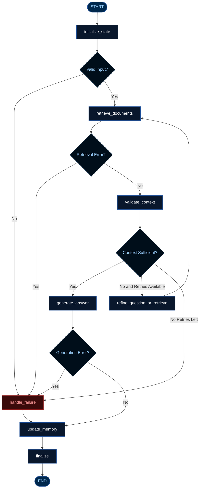

# Day 19 — Stateful Document Question-Answering Workflow Using LangGraph

A modular, stateful question-answering workflow built with **LangGraph**, featuring deterministic nodes, shared state management, conditional routing, bounded retry loops with query refinement, thread-scoped checkpoint memory via `InMemorySaver`, and comprehensive error handling.

---

## 1. Project Overview

### Objective
To design and implement a reliable documentation research assistant using **LangGraph** (v1.2.11) that processes user queries against synthetic corporate policies, verifies context relevance, refines search queries when context is insufficient, safely falls back on out-of-domain queries, and tracks conversation history across multi-turn sessions using thread IDs.

### Key Capabilities
- **LangGraph StateGraph Architecture:** 8 distinct nodes managing a clean, cyclic execution graph.
- **Deterministic Routing:** Conditional branching based on input validity, retrieval success, context sufficiency, and generation safety.
- **Bounded Retry Loop:** Enforces a hard ceiling on query refinements (maximum 3 total retrieval attempts), limiting the number of retrieval attempts and preventing the intended retry path from continuing indefinitely.
- **Thread-Scoped Memory:** Checkpoint-based state restoration using `InMemorySaver` with configurable `thread_id`.
- **Offline & Self-Contained:** Utilizes local dense embeddings (`sentence-transformers/all-MiniLM-L6-v2`) over synthetic corporate policy documents. Zero external API keys or cloud dependencies required.

---

## 2. Architecture & Workflow Diagram



---

## 3. Workflow Nodes & Responsibilities

| # | Node Name | Primary Responsibility |
|:---:|:---|:---|
| **1** | `initialize_state` | Validates input string; preserves restored `conversation_history`; resets turn counters (`retrieval_attempts = 0`). |
| **2** | `retrieve_documents` | Dispatches `retrieval_query` to vector retriever; increments attempt counter; handles exceptions. |
| **3** | `validate_context` | Checks chunk count, substantive content length, and cosine similarity threshold ($\ge 0.45$). |
| **4** | `refine_question_or_retrieve` | Strips filler words; adds domain topic expansion from conversation history; routes back to retrieval. |
| **5** | `generate_answer` | Deterministically selects relevant text sections from top chunks; formats citations; caveats documentation bounds. |
| **6** | `handle_failure` | Generates polite, actionable fallback messages for validation rejections, errors, or no-context outcomes. |
| **7** | `update_memory` | Appends completed turn to `conversation_history` without duplicates. |
| **8** | `finalize` | Validates final state integrity; sets final status (`completed` / `fallback_completed`). |

---

## 4. Technology Stack

- **Python:** 3.10+ (Verified on Python 3.14.3 64-bit)
- **Orchestration:** `langgraph` (v1.2.11), `langchain-core` (v1.6.3)
- **Embeddings:** `sentence-transformers` (v6.0.1, model: `all-MiniLM-L6-v2`, 384-dimensional)
- **Vector Operations:** `numpy` (v2.5.0, normalized inner product cosine similarity)
- **Schema Validation:** `pydantic` (v2.13.4)
- **Testing:** `pytest` (v9.1.1)

---

## 5. Directory Structure

```text
Day-19/
├── README.md
├── requirements.txt
├── .gitignore
├── run_workflow.py
│
├── data/
│   ├── sample_onboarding.txt
│   ├── sample_leave_policy.txt
│   ├── sample_training_guidelines.txt
│   └── sample_project_workflow.txt
│
├── app/
│   ├── __init__.py
│   ├── config.py
│   ├── state.py
│   ├── retriever.py
│   ├── nodes.py
│   ├── workflow.py
│   ├── memory.py
│   └── utils.py
│
├── docs/
│   ├── WORKFLOW_ANALYSIS_REPORT.md
│   ├── ERROR_HANDLING_NOTES.md
│   ├── MEMORY_DESIGN.md
│   ├── IMPLEMENTATION_EXPLANATION.md
│   └── LIMITATIONS_AND_FUTURE_IMPROVEMENTS.md
│
├── diagrams/
│   ├── langgraph_workflow.mmd
│   ├── conditional_routing.mmd
│   └── memory_flow.mmd
│
├── examples/
│   ├── normal_question.json
│   ├── insufficient_context.json
│   ├── retry_recovery.json
│   └── memory_followup.json
│
├── tests/
│   └── test_workflow.py
│
└── outputs/
    ├── pytest_results.txt
    ├── execution_trace.md
    └── verification_summary.md
```

---

## 6. Installation & Execution

### 1. Install Dependencies
```bash
python -m pip install -r Day-19/requirements.txt
```

### 2. Run All Verification Scenarios
```bash
python Day-19/run_workflow.py --run-all-scenarios
```

### 3. Run Single Query via CLI
```bash
python Day-19/run_workflow.py --query "What are the onboarding steps?" --thread-id "user-session-1"
```

### 4. Run Automated Test Suite
```bash
python -m pytest Day-19/tests/test_workflow.py -v
```

---

## 7. Verification Evidence

### Automated PyTest Results:
```text
============================= test session starts =============================
platform win32 -- Python 3.14.3, pytest-9.1.1, pluggy-1.6.0 -- C:\Python314\python.exe
rootdir: C:\Users\Priya\Downloads\internship
collected 31 items

Day-19/tests/test_workflow.py::test_01_graph_creation PASSED             [  3%]
Day-19/tests/test_workflow.py::test_02_graph_compilation_without_checkpointer PASSED [  7%]
Day-19/tests/test_workflow.py::test_03_graph_compilation_with_checkpointer PASSED [ 11%]
Day-19/tests/test_workflow.py::test_04_state_initialization_valid_input PASSED [ 14%]
Day-19/tests/test_workflow.py::test_05_state_schema_keys PASSED          [ 18%]
Day-19/tests/test_workflow.py::test_06_execution_trace_creation PASSED   [ 22%]
Day-19/tests/test_workflow.py::test_07_relevant_document_retrieval PASSED [ 25%]
Day-19/tests/test_workflow.py::test_08_no_relevant_document_retrieval PASSED [ 29%]
Day-19/tests/test_workflow.py::test_09_retrieval_metadata_preservation PASSED [ 33%]
Day-19/tests/test_workflow.py::test_10_retrieval_exception_handling PASSED [ 37%]
Day-19/tests/test_workflow.py::test_11_route_after_init PASSED           [ 40%]
Day-19/tests/test_workflow.py::test_12_route_after_retrieval PASSED      [ 44%]
Day-19/tests/test_workflow.py::test_13_route_after_validation PASSED     [ 48%]
Day-19/tests/test_workflow.py::test_14_retry_loop_bounded_execution PASSED [ 51%]
Day-19/tests/test_workflow.py::test_15_answer_generation_with_context PASSED [ 55%]
Day-19/tests/test_workflow.py::test_16_no_context_fallback_response PASSED [ 59%]
Day-19/tests/test_workflow.py::test_17_generation_exception_handling PASSED [ 62%]
Day-19/tests/test_workflow.py::test_18_empty_question_rejection PASSED   [ 66%]
Day-19/tests/test_workflow.py::test_19_whitespace_question_rejection PASSED [ 70%]
Day-19/tests/test_workflow.py::test_20_short_question_rejection PASSED   [ 74%]
Day-19/tests/test_workflow.py::test_21_memory_enabled_with_thread_id PASSED [ 77%]
Day-19/tests/test_workflow.py::test_22_conversation_history_update PASSED [ 81%]
Day-19/tests/test_workflow.py::test_23_multiple_turns_same_thread PASSED [ 85%]
Day-19/tests/test_workflow.py::test_24_thread_isolation PASSED           [ 88%]
Day-19/tests/test_workflow.py::test_25_successful_workflow_terminates PASSED [ 92%]
Day-19/tests/test_workflow.py::test_26_retry_loop_terminates_safely PASSED [ 96%]
Day-19/tests/test_workflow.py::test_27_final_response_expected_structure PASSED [100%]

Day-19/tests/test_workflow.py::test_28_interactive_exit_commands PASSED  [ 90%]
Day-19/tests/test_workflow.py::test_29_interactive_blank_input_handling PASSED [ 93%]
Day-19/tests/test_workflow.py::test_30_interactive_multiple_questions_memory PASSED [ 96%]
Day-19/tests/test_workflow.py::test_31_interactive_safe_termination_on_interrupt PASSED [100%]

============================= 31 passed in 23.32s =============================
```

---

## 8. Limitations & Production Roadmap

- **Prototype Context:** This project demonstrates LangGraph workflows using local synthetic data. It is an educational prototype, not an enterprise production service.
- **Extractive vs. Generative:** The deterministic extractive approach reduces the risk of unsupported generated content because the response is constructed from retrieved document chunks. However, it does not guarantee factual correctness or eliminate retrieval errors, and it limits conversational paraphrasing.
- **In-Memory Checkpointing:** `InMemorySaver` is volatile and resets upon application restart. Production systems should swap this for `PostgresSaver` or `RedisSaver`.

- **Hugging Face Hub Warning:** During model initialization, `sentence-transformers` checks the Hugging Face Hub cache metadata over HTTPS, producing an unauthenticated warning if `HF_TOKEN` is not configured. Although model weights are cached locally and execute inference offline, initial lookup contacts HF Hub unless `HF_HUB_OFFLINE=1` is explicitly exported in the environment.
