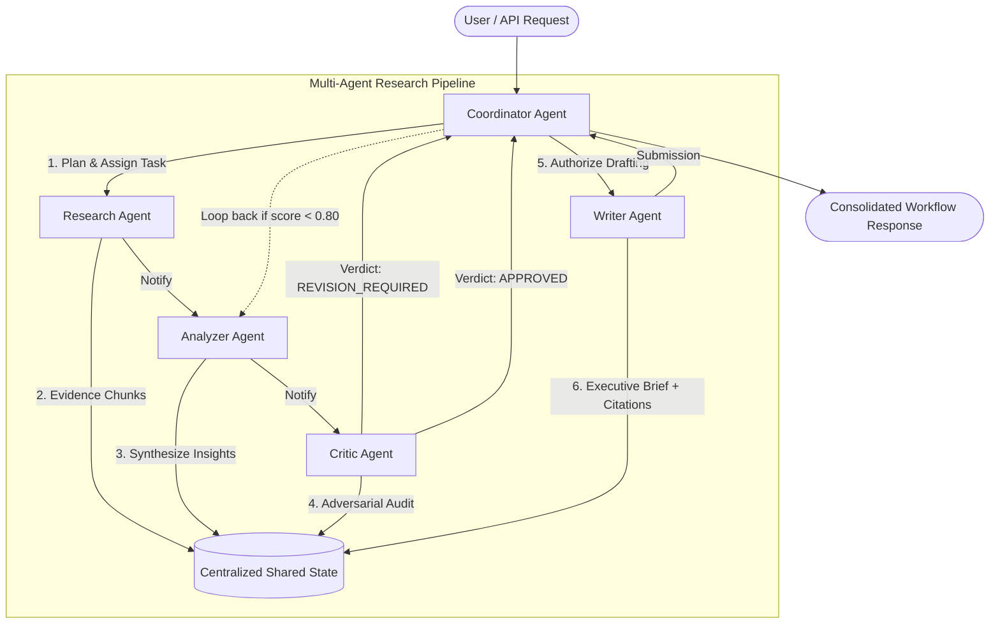

# Day 22: Multi-Agent AI Workflow Design

Welcome to the **Day 22 Multi-Agent AI Workflow Design & Practical Integration** project for the Linkific Enterprise AI Service.

This project designs and implements an enterprise-grade **Multi-Agent Research Assistant** system composed of five specialized autonomous agents operating over a thread-safe centralized shared state and an asynchronous message bus.

---

## 🎯 Learning Objectives & Deliverables Met

- **Agent Roles**: Specialized autonomous agents (`ResearchAgent`, `AnalyzerAgent`, `CriticAgent`, `WriterAgent`, `CoordinatorAgent`) with explicit operational boundaries and single responsibility.
- **Communication**: Asynchronous decoupled `MessageBus` with structured `AgentMessage` envelopes, correlation IDs, handler registration, and persistent JSONL audit logging (`data/activity_audit.jsonl`).
- **Shared State**: Centralized `SharedStateManager` with re-entrant thread safety (`threading.Lock`), role-governed field mutation ownership (`StatePermissionError`), deep-copy snapshot isolation, and state transition histories.
- **Workflow Planning**: Dynamic execution planning with milestone decomposition, automated adversarial quality gate reviews (`CriticAgent`), revision loops, and configurable circuit breakers (`max_revisions = 2`).

### Core Deliverables
1. **[Multi-Agent Responsibility Matrix](docs/RESPONSIBILITY_MATRIX.md)**: 7-column comprehensive specification matrix covering all 5 agents.
2. **[Multi-Agent Workflow Diagram](docs/MULTI_AGENT_WORKFLOW.md)**: Visual Mermaid flowchart and state lifecycle diagrams (`diagrams/`).
3. **[Architecture Notes](docs/ARCHITECTURE_NOTES.md)**: Deep architectural rationale, security boundaries, and enterprise integration patterns.
4. **[Shared State & Communication Guide](docs/SHARED_STATE_AND_COMMUNICATION.md)**: Complete guide to state ownership and message protocols.
5. **[Testing & Verification Report](docs/TESTING_AND_VERIFICATION_REPORT.md)**: 42 automated tests with 100% pass rate plus 116 cross-day regression tests.

---

## 🏗️ System Architecture



---

## 📁 Repository Structure

```text
Day-22/
├── app/
│   ├── __init__.py
│   ├── config.py                       # Configuration & threshold settings
│   ├── schemas.py                      # Pydantic v2 schemas & message types
│   ├── state.py                        # Thread-safe SharedStateManager
│   ├── communication.py                # Decoupled asynchronous MessageBus
│   ├── workflow.py                     # MultiAgentWorkflowEngine
│   └── agents/
│       ├── __init__.py
│       ├── base.py                     # BaseAgent abstract class
│       ├── research_agent.py           # Evidence retrieval & provenance
│       ├── analyzer_agent.py           # Cognitive clustering & synthesis
│       ├── critic_agent.py             # Adversarial auditing & quality gate
│       ├── writer_agent.py             # Executive briefing & citation matrix
│       └── coordinator_agent.py        # Planning, routing & circuit breaking
├── data/
│   ├── sample_docs.json                # Enterprise document corpus
│   └── activity_audit.jsonl            # Persistent message audit log
├── diagrams/
│   ├── multi_agent_workflow.mmd        # Mermaid workflow diagram
│   ├── agent_communication_sequence.mmd# Mermaid sequence diagram
│   └── shared_state_lifecycle.mmd      # State transition diagram
├── docs/
│   ├── RESPONSIBILITY_MATRIX.md        # Comprehensive 7-column matrix
│   ├── MULTI_AGENT_WORKFLOW.md         # Workflow lifecycle & revision loops
│   ├── ARCHITECTURE_NOTES.md           # Architectural decisions & patterns
│   ├── SHARED_STATE_AND_COMMUNICATION.md # State ownership & message spec
│   └── TESTING_AND_VERIFICATION_REPORT.md# Full test suite report
├── examples/
│   ├── sample_execution_trace.json     # Serialized execution trace
│   └── sample_generated_report.md      # Sample compiled markdown report
├── outputs/
│   ├── execution_summary.json          # Multi-scenario execution telemetry
│   └── verification_summary.md         # Objective verification checklist
├── tests/
│   ├── conftest.py
│   ├── test_schemas.py                 # Schema validation tests
│   ├── test_shared_state.py            # State thread-safety & permissions
│   ├── test_communication.py           # MessageBus delivery tests
│   ├── test_agents.py                  # Individual agent unit tests
│   ├── test_workflow.py                # End-to-end multi-agent pipeline tests
│   ├── test_revision_loop.py           # Revision loop & circuit breaker tests
│   ├── test_error_handling.py          # Error trapping & recovery tests
│   └── test_regression.py              # Days 17, 20, 21 regression tests
├── requirements.txt                    # Dependencies (pydantic, pytest)
├── run_workflow.py                     # Interactive CLI execution harness
└── README.md                           # Master Day 22 documentation
```

---

## 🚀 Quickstart & Execution

### 1. Install Dependencies
```bash
cd Day-22
pip install -r requirements.txt
```

### 2. Run the Multi-Agent Workflow CLI
You can execute pre-configured enterprise scenarios or run in interactive mode:

```bash
# Run Scenario 1: Enterprise HR Leave & Security Clearances
python run_workflow.py --scenario 1

# Run Scenario 2: Cloud Deployment Security & Incident Response Protocols
python run_workflow.py --scenario 2

# Run Scenario 3: Code Review Standards & Microservice Quality Gates
python run_workflow.py --scenario 3

# Run all 3 scenarios consecutively
python run_workflow.py --all

# Run interactive mode with custom user prompt
python run_workflow.py --interactive
```

### 3. Run the Automated Test Suite
Execute the full Day 22 test suite verifying all 42 test cases:

```bash
pytest tests/ -v
```

Expected output:
```text
============================= 42 passed in 15.69s =============================
```

### 4. Run Full Cross-Day Regression Verification
Verify zero regressions across previous internship milestones (116 tests):

```bash
pytest ../Day-17/tests/ -q   # 14 passed
pytest ../Day-20/tests/ -q   # 58 passed
pytest ../Day-21/tests/ -q   # 44 passed
```

---

## 🔒 Security & Quality Controls

1. **Role-Governed Mutation**: Agents can only write to their designated state fields. Unauthorized writes trigger a `StatePermissionError`.
2. **Adversarial Gate**: The `CriticAgent` validates that all claims reference empirical document IDs (`[DOC-XXX]`) and enforces a minimum quality score ($0.80$).
3. **Circuit Breaker**: When revisions exceed `MAX_REVISIONS = 2`, the workflow halts gracefully with `COMPLETED_WITH_WARNINGS` to prevent infinite resource drain.
4. **Audit Trail**: Every inter-agent message is appended to `data/activity_audit.jsonl` with timestamps, sender, recipient, and message payload.
