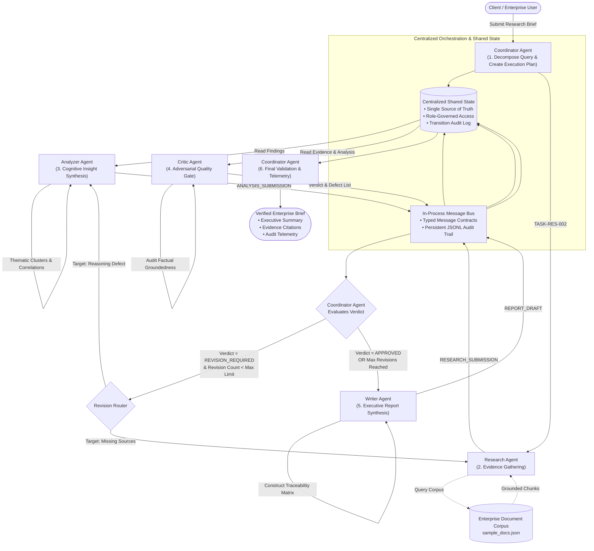

# Day 22: Multi-Agent Workflow Design & Execution Lifecycle

This document describes the orchestration architecture, workflow planning, execution phases, and revision loop mechanics of the **Linkific Multi-Agent Research Assistant** system.

---

## 1. System Architecture & Workflow Diagram

The system employs a collaborative hub-and-spoke multi-agent topology governed by a central **Coordinator Agent**, an audited **MessageBus**, and a centralized **SharedState** single-source-of-truth.

---

## 2. Step-by-Step Execution Phases

### Phase 1: Planning & Topology Construction (`CoordinatorAgent`)
1. Ingests user research brief via `WorkflowRequest`.
2. Validates query constraints (`min_length=3`, `max_length=1000`).
3. Instantiates `SharedStateManager` and `MessageBus` with a unique `workflow_id`.
4. Decomposes the research objective into a deterministic 6-milestone `ExecutionPlan`:
   - `TASK-PLAN-001`: Request analysis and topology definition.
   - `TASK-RES-002`: Evidence retrieval and provenance indexing.
   - `TASK-ANA-003`: Cognitive insight synthesis and correlation mapping.
   - `TASK-CRI-004`: Adversarial verification and quality audit.
   - `TASK-WRI-005`: Executive briefing synthesis and citation embedding.
   - `TASK-FIN-006`: Final validation sign-off and audit compilation.
5. Transitions workflow state to `WorkflowStatus.PLANNING` -> `WorkflowStatus.RESEARCHING`.

### Phase 2: Evidence Gathering & Provenance (`ResearchAgent`)
1. Receives `TASK_ASSIGNMENT` from the MessageBus.
2. Tokenizes query, filters stop words, and scans the vetted enterprise document corpus (`sample_docs.json`).
3. Computes lexical overlap and category affinity scores.
4. Filters documents exceeding relevance threshold (`SIMILARITY_THRESHOLD = 0.10`).
5. Extracts exact verbatim excerpts, doc IDs, author metadata, and version numbers.
6. Emits structured `ResearchFindings` into `SharedState`.
7. Dispatches `RESEARCH_SUBMISSION` message notifying the `AnalyzerAgent`.

### Phase 3: Cognitive Synthesis & Correlation Analysis (`AnalyzerAgent`)
1. Reads `ResearchFindings` from `SharedState`.
2. Groups evidence into thematic clusters (e.g., Human Resources, InfoSec, Engineering).
3. Synthesizes individual `InsightItem` objects, binding each insight to supporting evidence IDs.
4. Identifies cross-domain policy intersections (e.g., remote work attendance vs. VPN/MFA compliance).
5. Segregates empirical facts from working assumptions if evidence is limited.
6. Populates `AnalysisResult` in `SharedState` and emits `ANALYSIS_SUBMISSION` to the Critic.

### Phase 4: Adversarial Quality Gate (`CriticAgent`)
1. Ingests both `ResearchFindings` and `AnalysisResult`.
2. Executes four deterministic quality checks:
   - **Check 1: Evidence Availability**: Confirms evidence items exist and meet minimum threshold.
   - **Check 2: Citation Validity**: Confirms all cited doc IDs actually exist in the retrieved corpus. Flags phantom citations as `HALLUCINATION` (CRITICAL severity).
   - **Check 3: Unsupported Claims**: Flags any statement without supporting source IDs as `UNSUPPORTED_CLAIM` (MAJOR severity).
   - **Check 4: Scope Coverage**: Verifies that primary user concepts appear in evidence.
3. Computes holistic `quality_score` (0.0 to 1.0) with penalties for defects.
4. Issues verdict:
   - `CriticVerdict.APPROVED`: If `quality_score >= 0.80` and zero CRITICAL defects.
   - `CriticVerdict.REVISION_REQUIRED`: If score < 0.80 or CRITICAL defects are detected.
5. Appends `CriticReview` to SharedState and notifies Coordinator.

### Phase 5: Dynamic Revision Loop & Circuit Breaker
1. `CoordinatorAgent` evaluates the Critic's verdict:
   - **Path A (Approved)**: Advances workflow to `WorkflowStatus.WRITING`.
   - **Path B (Revision Required & Under Limit)**:
     - Increments `revision_count` in `SharedState`.
     - Sets state to `WorkflowStatus.REVISING`.
     - Analyzes defect list to identify target agent (`RESEARCH` or `ANALYZER`).
     - Re-invokes target agent with specific correction instructions (e.g. broader search keywords).
     - Loops back through Analyzer and Critic until approved.
   - **Path C (Revision Required & Max Limit Exceeded)**:
     - **Circuit Breaker Triggered**: Coordinator logs a formal warning, flags the report as qualified/partial, and advances to Writer to prevent an infinite loop.

### Phase 6: Executive Synthesis & Delivery (`WriterAgent` & `CoordinatorAgent`)
1. `WriterAgent` structures findings into publication-ready Markdown:
   - Executive Summary
   - Thematic Sections with inline `[DOC-XXX]` citation badges
   - Cross-Policy Intersections
   - Explicit Operational Boundaries & Limitations
   - Evidence Traceability Matrix (mapping statement IDs to source documents)
   - Strategic Recommendations
2. `CoordinatorAgent` finalizes state to `WorkflowStatus.COMPLETED`, compiles execution timing, and returns a verified `WorkflowResponse`.
