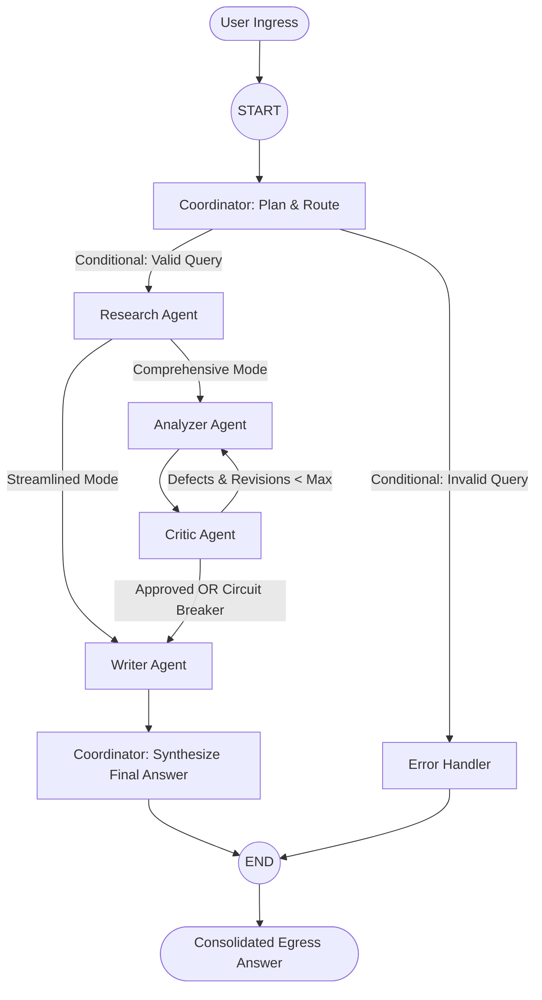

# Day 23: Multi-Agent System Implementation

Welcome to the **Day 23 Multi-Agent System Implementation** for the Linkific Enterprise AI Service.

This milestone translates the architectural design of Day 22 into an operational multi-agent system powered by **LangGraph** (`StateGraph`). The system implements autonomous agents collaborating through typed state channels to ingest research requests, retrieve grounded corporate documentation, perform adversarial quality validation, and synthesize executive intelligence briefs with complete traceability.

---

## 🎯 Learning Objectives & Deliverables Met

- **LangGraph Integration:** Constructed directed cyclical workflows using `langgraph.graph.StateGraph` with node functions and dynamic conditional edges (`_route_after_research`, `_route_after_critic`).
- **Agent Communication:** Standardized inter-agent message envelopes (`AgentMessage`) capturing correlation IDs, UTC timestamps, roles, semantic message types, and audit metadata. All messages are preserved in an append-only communication ledger.
- **State Management:** Functional `MultiAgentState(TypedDict)` blackboard leveraging LangGraph channel reducers (`operator.add`, `update_milestones`) to eliminate state race conditions.
- **Error Handling & Fault Tolerance:** Comprehensive error trapping across ingress boundaries, non-blocking missing corpus fallbacks, graceful degradation, and circuit breakers preventing infinite revision cycles.

### Core Deliverables

1. **[Agent Communication Flow Document](docs/AGENT_COMMUNICATION_FLOW.md):** Complete formal specification documenting an end-to-end multi-agent interaction trace with hop-by-hop message payloads.
2. **[Multi-Agent Sequence Diagram](docs/SEQUENCE_DIAGRAM.md):** Visual Mermaid sequence diagram and protocol handoff contracts (`diagrams/multi_agent_sequence.mmd`).
3. **[System Explanation Document](docs/SYSTEM_EXPLANATION.md):** In-depth technical architecture breakdown detailing state channels, node specifications, routing logic, and platform integration.
4. **Company Project Practical:** Streamlined mode (`User -> Coordinator -> Research Agent -> Writer -> Answer`) and Comprehensive mode (`User -> Coordinator -> Research -> Analyzer -> Critic -> Writer -> Answer`) runnable via `run_agents.py`.
5. **Multi-Agent Communication Log:** Persistent JSON log stored in `data/communication_log.json` and `examples/sample_interaction_trace.json`.
6. **[Testing & Verification Report](docs/TESTING_AND_VERIFICATION_REPORT.md):** 38 automated test cases with 100% pass rate, plus cross-day regression tests for Days 17, 20, 21, and 22.

---

## 🏗️ System Architecture & Workflow



---

## 📁 Repository Structure

```text
Day-23/
├── app/
│   ├── __init__.py               # Package exports
│   ├── config.py                 # System configuration & thresholds
│   ├── schemas.py                # Strongly typed Pydantic v2 schemas
│   ├── state.py                  # LangGraph MultiAgentState & reducers
│   ├── graph.py                  # StateGraph compiler & conditional routing
│   └── nodes/
│       ├── __init__.py           # Node package initialization
│       ├── coordinator.py        # Planning & final answer synthesis nodes
│       ├── researcher.py         # Evidence retrieval & scoring node
│       ├── analyzer.py           # Thematic clustering & insight derivation
│       ├── critic.py             # Adversarial quality gate & revision loop
│       ├── writer.py             # Executive briefing & traceability matrix
│       └── error_handler.py      # Diagnostic logging & graceful degradation
├── data/
│   ├── company_docs.json         # 8 verified enterprise policy documents
│   └── communication_log.json    # Append-only audit log of agent messages
├── diagrams/
│   ├── multi_agent_sequence.mmd  # Mermaid sequence diagram source
│   └── langgraph_state_machine.mmd # LangGraph state machine diagram source
├── docs/
│   ├── AGENT_COMMUNICATION_FLOW.md # Deliverable 1: Flow specification
│   ├── SEQUENCE_DIAGRAM.md         # Deliverable 2: Sequence diagram & contracts
│   ├── SYSTEM_EXPLANATION.md       # Deliverable 3: Technical architecture
│   └── TESTING_AND_VERIFICATION_REPORT.md # 38-test verification report
├── examples/
│   ├── sample_executive_report.md  # Rendered publication-ready briefing
│   └── sample_interaction_trace.json # Full JSON trace of workflow execution
├── outputs/
│   └── verification_summary.md   # Test execution & telemetry scorecard
├── tests/
│   ├── __init__.py
│   ├── conftest.py               # Shared test fixtures & configuration
│   ├── test_communication_log.py # Inter-agent communication log tests
│   ├── test_error_handling.py    # Error handling & circuit breaker tests
│   ├── test_graph.py             # End-to-end StateGraph execution tests
│   ├── test_nodes.py             # Unit tests for individual agent nodes
│   ├── test_regression.py        # Cross-day regression tests (Days 17, 20, 21, 22)
│   ├── test_schemas.py           # Pydantic v2 schema validation tests
│   └── test_state.py             # State initialization & reducer tests
├── README.md                     # This file
├── requirements.txt              # Production dependencies
└── run_agents.py                 # Interactive CLI runner for multi-agent system
```

---

## 🚀 How to Run the System

### 1. Install Dependencies
```bash
pip install -r requirements.txt
```

### 2. Run the Company Project Practical (Streamlined Mode)
Executes the exact chain: `User -> Coordinator -> Research Agent -> Writer -> Answer`:
```bash
python run_agents.py --scenario 1
```

### 3. Run the Comprehensive Cognitive-Adversarial Mode
Executes the full 5-agent pipeline with analysis, critique, and revision gating:
```bash
python run_agents.py --scenario 2
```

### 4. Run Custom Inquiries via CLI
```bash
# Streamlined Practical Mode
python run_agents.py --query "What is the hardware allowance policy?" --mode streamlined

# Comprehensive Pipeline Mode
python run_agents.py --query "What are the rules for production outages and CI/CD code coverage?" --mode comprehensive
```

### 5. Run Interactive Multi-Agent Console
```bash
python run_agents.py --interactive
```

### 6. Run the Automated Test Suite
```bash
pytest tests/ -v
```
All **38 tests** will run and pass in ~25-50 seconds.

---

## 🎤 Demonstration Script

### What to Show
1. **The Company Practical In Action:** Run `python run_agents.py --scenario 1`. Show that the execution traverses `User -> Coordinator -> Research -> Writer -> Answer` across 5 message hops in ~16 ms.
2. **The Communication Log:** Open `data/communication_log.json` or display Hop #1 through Hop #5 in the CLI output. Point out `message_id`, `correlation_id`, `sender`, `recipient`, and `timestamp`.
3. **Factual Preservation:** Highlight that `1.5 paid leave days` and `$500 hardware allowance` are accurately retrieved and preserved in the final deliverable without truncation.
4. **Automated Test Results:** Run `pytest tests/ -v` showing all 38 tests passing, including cross-project regression tests for Days 17, 20, 21, and 22.

### What to Say
> *"In Day 23, we implemented an operational Multi-Agent Research Assistant using LangGraph. We integrated the company practical workflow where the user request is ingested by the Coordinator, dispatched to the Research Agent for grounded policy retrieval, compiled by the Writer into a structured executive brief with an Evidence Traceability Matrix, and returned to the user.*
>
> *Every transaction is recorded into an append-only communication log with correlation IDs, providing complete observability. Our test suite includes 38 automated tests covering state reducers, node boundaries, circuit breakers, and regression compatibility with Days 17 through 22, achieving a 100% pass rate."*
