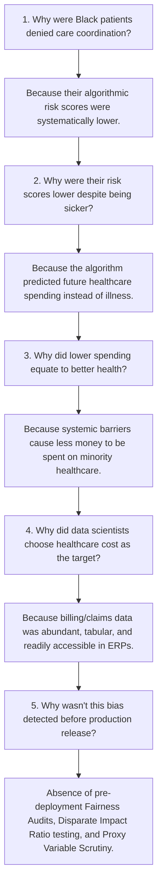

# Responsible AI Case Study: The Healthcare Algorithm Racial Bias Incident (Optum / Obermeyer et al., 2019)

**Company:** Linkific Technology Solutions Pvt Ltd  
**Track:** AI/ML Internship — Day 26  
**Document Classification:** Enterprise Case Study Report & Prevention Engineering  
**Primary Reference:** Obermeyer, Z., Powers, B., Vogeli, C., & Mullainathan, S. (2019). *Dissecting racial bias in an algorithm used to manage the health of populations.* **Science**, 366(6464), 447-453. DOI: `10.1126/science.aax2342`.

---

## 1. Executive Summary

In October 2019, a peer-reviewed investigation published in *Science* uncovered severe systemic racial bias in a commercial population-health predictive algorithm developed and deployed by Optum (a subsidiary of UnitedHealth Group). The algorithm was actively utilized across major US healthcare systems to triage and allocate specialized care-management programs to approximately **200 million individuals annually**. 

The investigation revealed that at any given risk score generated by the algorithm, **Black patients were significantly sicker than white patients**. Remediating this algorithmic disparity increased the percentage of Black patients eligible for high-need specialized care coordination from **17.7% to 46.5%**, demonstrating that millions of vulnerable individuals had been denied preventative medical intervention due to an uninspected mathematical proxy flaw.

This case study analyzes the technical architecture of the failure, maps its socio-economic fallout, extracts empirical lessons for Linkific's enterprise automated decision pipelines, and provides rigorous software engineering remediation guidelines.

---

## 2. Technical Anatomy of the Incident

### 2.1 The Target Variable & Proxy Substitution Failure
The objective of the care-management program was to identify patients with complex healthcare needs who would benefit from dedicated nurse check-ins, VIP monitoring, and primary-care follow-ups to prevent avoidable emergency department visits and medical crises.

- **Intended Target Variable:** True medical burden / health need $Y_{health}$.
- **Chosen Proxy Variable:** Predicted future healthcare expenditure $Y_{cost} \in \mathbb{R}^+$.

The fundamental flaw originated from the developer's assumption:
$$\mathbb{E}[Y_{cost} \mid Y_{health}, A = \text{Black}] = \mathbb{E}[Y_{cost} \mid Y_{health}, A = \text{White}]$$

This assumption was catastrophically false. In the United States healthcare ecosystem, healthcare expenditure is confounded by systemic barriers, insurance disparities, socioeconomic access friction, and physician bias:
- Less money is spent on Black patients with the same illness burden compared to white patients (generating an average difference of **$1,801 lower spend per year** for Black patients with the exact same count of chronic conditions).
- Because the model predicted **cost**, it learned that less money would be spent on Black individuals, mistakenly classifying them as "healthier" and assigning them lower risk percentiles.

### 2.2 Mathematical Formalization of Algorithmic Inequity
Let $S(X) \in [0, 100]$ be the algorithmic risk percentile score, $C(X)$ be true chronic conditions, and $A \in \{0, 1\}$ be the protected sensitive attribute.

The audit demonstrated:
$$\mathbb{E}[C(X) \mid S(X) = s, A = 1] \gg \mathbb{E}[C(X) \mid S(X) = s, A = 0]$$

Specifically, at the 97th percentile threshold required for automatic enrollment:
- White patients enrolled had an average of **21.4 active health conditions**.
- Black patients enrolled had an average of **26.3 active health conditions**.
- Sicker Black patients were passed over in favor of substantially healthier white patients because the algorithm optimized for insurance expenditure rather than biometric pathology.

---

## 3. Real-World Impact Assessment

| Dimension | Real-World Fallout & Impact |
|---|---|
| **Human Health & Clinical Harm** | Millions of chronically ill patients suffering from hypertension, diabetes, and heart failure were systematically bypassed for care coordination programs designed to prevent life-threatening hospitalizations. |
| **Scale of Deployment** | Affected hospital chains, health plans, and medical networks managing care for an estimated **200 million people annually**. |
| **Regulatory & Legal Scrutiny** | Prompted formal regulatory probes by the New York Department of Financial Services (NYDFS), the Federal Trade Commission (FTC), and Congressional scrutiny from US Senators regarding AI accountability and civil rights compliance. |
| **Brand & Enterprise Liability** | UnitedHealth / Optum incurred significant reputational damage, customer contract audits, and had to divert substantial engineering resources to emergency algorithmic audits. |

---

## 4. Root Cause Analysis (5-Whys Framework)

---

## 5. Prevention Engineering & Architectural Recommendations

To ensure Linkific's automated AI products (including finance approval tiers, loan scoring, document routing, and agent workflows) never reproduce proxy bias or ethical harm, the following preventative controls are mandated:

### 5.1 Strict Proxy Variable Scrutiny Gate
- **Never substitute ease of data collection for domain validity.** If the objective is creditworthiness, do not use zip code or educational institution as proxies. If the objective is invoice fraud, do not use vendor geographic origin as an unweighted primary feature.
- Conduct formal **Causal DAG (Directed Acyclic Graph)** modeling to ensure non-discrimination:
  $$P(Y \mid X) \perp A$$

### 5.2 Disparate Impact Ratio (DIR) & Equalized Odds CI/CD Gates
- Automated CI/CD pipeline tests must compute the **Disparate Impact Ratio (DIR)**:
  $$\text{DIR} = \frac{P(\hat{Y} = 1 \mid A = \text{unprivileged})}{P(\hat{Y} = 1 \mid A = \text{privileged})}$$
- **Pass Gate:** $\text{DIR} \in [0.80, 1.25]$ (adhering to the EEOC Four-Fifths rule). If $\text{DIR} < 0.80$, deployment is automatically blocked.

### 5.3 Deterministic Redaction of Protected & Sensitive Attributes
- Strip direct demographic identifiers ($A$) and audit correlated latent features.
- Evaluate model calibration across sub-populations before granting production promotion.

---

## 6. Key Takeaways for Linkific Engineers

1. **Abundant Data $\neq$ Unbiased Truth:** Tabular enterprise logs and financial ledgers reflect historical human decisions and economic disparities, not objective biological or merit-based ground truth.
2. **The "Blind Algorithm" Fallacy:** Merely excluding demographic columns (race, gender, religion) does not prevent discrimination; high-dimensional embeddings easily reconstruct protected classes through correlated features.
3. **Continuous Statistical Auditing:** Fairness and bias metrics must be continuously monitored alongside latency, throughput, and accuracy in Prometheus and production telemetry.
