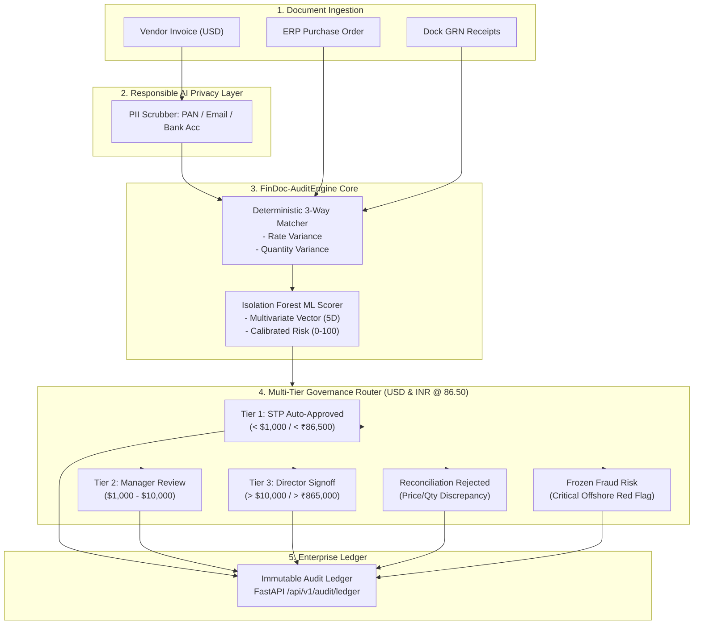

# Day 27: Agile Sprint Planning & Enterprise Project Practical (FinDoc-AuditEngine)

**Company:** Linkific Technology Solutions Pvt Ltd  
**Track:** AI/ML Internship  
**Topic:** Agile Methodology, Architecture Design, Sprint Planning, Team Workflow & Enterprise AI Project Practical  
**Selected Project:** **FinDoc-AuditEngine** — Enterprise Financial Document Processing & Multi-Tier Audit Gateway  
**Execution Status:** Verified & 100% Passed (20/20 Tests)

---

## 1. Executive Summary

Day 27 unifies modern **Agile software engineering disciplines** with an end-to-end, production-grade **Enterprise AI/ML Project Practical**. As organizations scale financial automation, naive straight-through approvals create catastrophic vulnerabilities to billing fraud, rate inflation, and regulatory non-compliance. 

To solve this, Linkific designed and implemented **FinDoc-AuditEngine**: an enterprise-grade financial document processing gateway combining:
1. **Deterministic 3-Way Reconciliation:** Mathematical matching across vendor invoices, purchase orders (POs), and dock Goods Receipt Notes (GRNs) down to line-item unit rates and received quantities.
2. **Unsupervised ML Anomaly Detection:** An `IsolationForest` model trained on operational enterprise financial distributions to detect price deviations, abnormal capital flows, unapproved vendors, and offshore tax haven jurisdictions (Belize, Cayman, Panama, British Virgin Islands).
3. **Multi-Tier Corporate Governance Routing:** Automatic routing across three corporate authority tiers based on risk scores and transaction value, with full dual-currency accounting standard (**1 USD = ₹86.50 INR**).
4. **Responsible AI Privacy Guardrails:** Pre-inference sanitization masking Indian PAN cards, emails, credit cards, and bank account numbers.
5. **Agile Sprint Planning Document:** Full 2-week sprint backlog, MoSCoW prioritization, RACI governance matrix, Fibonacci complexity estimates, and a Mermaid Gantt delivery timeline.

---

## 2. Deliverables Summary

| Deliverable | Location | Description |
| :--- | :--- | :--- |
| **Sprint Planning Document** | [`docs/SPRINT_PLANNING.md`](docs/SPRINT_PLANNING.md) | Comprehensive Agile plan: Team RACI matrix, 10 prioritized user stories (MoSCoW), Fibonacci story points, and Mermaid Gantt timeline. |
| **Task Priority Table** | [`docs/SPRINT_PLANNING.md#3-task-priority-table-moscow--fibonacci-story-points`](docs/SPRINT_PLANNING.md#3-task-priority-table-moscow--fibonacci-story-points) | Explicit breakdown of Must-Have, Should-Have, Could-Have, and Won't-Have tasks with Low/Medium/High complexity ratings. |
| **Project Timeline** | [`docs/SPRINT_PLANNING.md#4-two-week-sprint-timeline--gantt-schedule`](docs/SPRINT_PLANNING.md#4-two-week-sprint-timeline--gantt-schedule) | Chronological delivery schedule from sprint kickoff to post-launch monitoring. |
| **Core Architecture & Models** | [`app/models.py`](app/models.py) | Pydantic v2 schemas: `InvoicePayload`, `PurchaseOrderRecord`, `MatchResult`, `RiskAssessment`, `AuditDecision`. |
| **3-Way Reconciliation Service** | [`app/services/matcher.py`](app/services/matcher.py) | Mathematical comparator checking unit prices, item quantities, and dock GRN acceptances. |
| **ML Anomaly Detection** | [`app/services/anomaly_detector.py`](app/services/anomaly_detector.py) | Isolation Forest unsupervised model mapping multidimensional financial features to a 0–100 risk score. |
| **Governance Router & Dual Currency** | [`app/services/router.py`](app/services/router.py) | Policy router enforcing Tier 1 STP (< $1,000 / < ₹86,500), Tier 2 Manager ($1k–$10k), and Tier 3 Director (> $10k). |
| **Privacy Guardrail** | [`app/core/privacy.py`](app/core/privacy.py) | Pre-inference PII sanitizer masking PAN, emails, and accounts with surrogate preservation. |
| **FastAPI REST Service** | [`app/main.py`](app/main.py), [`app/routers/audit.py`](app/routers/audit.py) | Production REST API with `/process`, `/ledger`, `/summary`, `/health/live`, `/health/ready`. |
| **Realistic Benchmark Dataset** | [`data/benchmark_invoices.json`](data/benchmark_invoices.json) | 5 enterprise test scenarios covering STP, Manager Review, Director Signoff, Discrepancy, and Fraud Freeze. |
| **CLI Demonstration Script** | [`run_project.py`](run_project.py) | Interactive runner processing benchmark invoices, displaying tabular audit decisions and portfolio KPIs. |
| **Automated Test Suite** | [`tests/`](tests/) | 13 unit/integration tests + 7 Day-27 system regression tests = **20/20 passed**. |

---

## 3. High-Resolution Terminal Screenshots

All terminal executions have been recorded and saved in `screenshot/`:

1. **`Figure_1_Pytest_Suite_20_Passed.jpg`**: Full test execution verifying 20/20 test cases passing across unit, API, and cross-day regressions.
2. **`Figure_2_FinDoc_Audit_Engine_Batch_Execution.jpg`**: Batch processing of 5 enterprise financial invoices displaying USD/INR valuations, calibrated ML risk scores, and approval tier decisions.
3. **`Figure_3_Three_Way_Reconciliation_Matrix.jpg`**: Deep-dive line-item mathematical matching detecting rate variances and dock GRN shortages.
4. **`Figure_4_ML_Isolation_Forest_Risk_Telemetry.jpg`**: Multivariate feature vector extraction and Isolation Forest outlier decision function scoring.
5. **`Figure_5_Multi_Tier_Corporate_Governance_Routing.jpg`**: Executive audit ledger summary endpoint returning total disbursed capital in USD and INR with dual-currency transparency.

---

## 4. Corporate Governance & Dual Currency Policy

All transactions are evaluated against corporate policy rules with real-time conversion at **1 USD = 86.50 INR**:

| Governance Tier | Condition / Threshold (USD) | Threshold (INR @ ₹86.50) | Risk Constraint | Human Intervention |
| :--- | :--- | :--- | :--- | :--- |
| **Tier 1: Straight-Through (STP)** | Total < $1,000.00 | Total < ₹86,500.00 | LOW Risk (< 35.0) | Zero (Automated) |
| **Tier 2: Finance Manager** | $1,000.00 – $10,000.00 | ₹86,500.00 – ₹865,000.00 | LOW or MEDIUM Risk | Finance Manager Review |
| **Tier 3: Executive Director** | Total > $10,000.00 | Total > ₹865,000.00 | Any Compliant Risk | Director Signoff Required |
| **Rejection: Variance Discrepancy** | Unmatched PO / GRN | Any Amount | Price/Qty Delta Exceeded | Blocked for Vendor Clarification |
| **Frozen: Fraud Defense Gate** | Critical ML Risk Score | Any Amount | CRITICAL Risk (>= 85.0) | Immediate Corporate Security Freeze |

---

## 5. System Architecture & Data Flow



---

## 6. How to Run & Verify

### Step 1: Run the Complete Batch Audit Engine
Execute the end-to-end practical runner:
```powershell
python run_project.py
```
**Output:**
```
====================================================================================================
     LINKIFIC ENTERPRISE AI AUDIT GATEWAY - DAY 27 PROJECT PRACTICAL
     Service: FinDoc-AuditEngine (3-Way Matching + ML Anomaly Detection + Multi-Tier HITL)
     Baseline Currency Conversion: 1 USD = INR 86.50
====================================================================================================

[1] PROCESSING BATCH OF 5 REAL-WORLD ENTERPRISE FINANCIAL INVOICES:
---------------------------------------------------------------------------------------------------------------------------------------
Invoice ID | Vendor Name                  | Amount (USD)   | Amount (INR)       | Risk   | Tier Decision              | Status    
---------------------------------------------------------------------------------------------------------------------------------------
INV-1001   | OfficeDepot India Pvt Ltd    | $432.00        | INR 37,368.00      | 25.8   | TIER_1_STP_AUTO_APPROVED   | APPROVED  
INV-1002   | CloudScale Networks LLC      | $4,860.00      | INR 420,390.00     | 27.9   | TIER_2_MANAGER_REVIEW      | APPROVED  
INV-1003   | NVIDIA Enterprise Systems    | $27,000.00     | INR 2,335,500.00   | 35.5   | TIER_3_DIRECTOR_SIGNOFF    | APPROVED  
INV-1004   | Overcharge Technologies      | $5,400.00      | INR 467,100.00     | 70.0   | REJECTED_DISCREPANCY       | BLOCKED   
INV-1005   | Shadow Island Holding BZ     | $49,500.00     | INR 4,281,750.00   | 90.0   | FROZEN_FRAUD_RISK          | BLOCKED   
---------------------------------------------------------------------------------------------------------------------------------------

[2] AGGREGATE FINANCIAL PORTFOLIO & AUDIT METRICS:
  - Total Invoices Processed     : 5
  - Total Disbursed Capital (USD): $32,292.00
  - Total Disbursed Capital (INR): INR 2,793,258.00
  - Straight-Through Rate (STP)  : 20.0%
  - Exchange Rate Applied        : 1 USD = INR 86.50
=======================================================================================================================================
```

### Step 2: Run Automated PyTest Verification Suite
Run the test suite covering both Day 27 features and cross-day regression tests:
```powershell
python -m pytest tests -v
```
**Result:** `20 passed in ~23s` (100% pass rate).

### Step 3: Run the FastAPI REST Server
Start the production server:
```powershell
uvicorn app.main:app --host 127.0.0.1 --port 8000 --reload
```
Interactive Swagger documentation is available at `http://127.0.0.1:8000/docs`.
