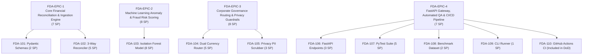
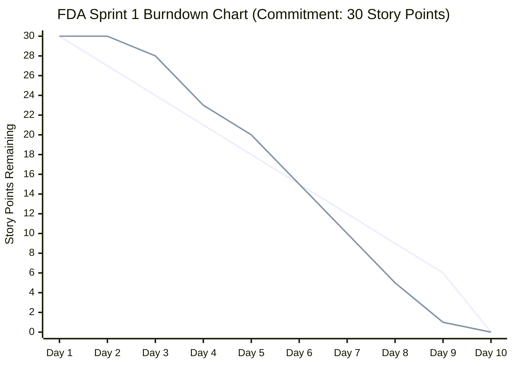

# FinDoc-AuditEngine — Jira Sprint Planning & Scrum Board Specification

**Project Name:** Enterprise Financial Document Processing & Multi-Tier Audit Gateway  
**Project Key:** `FDA`  
**Board Type:** Jira Scrum Board (Linkific AP Automation Team)  
**Sprint Name:** `FDA Sprint 1 — MVP Core Audit Engine & ML Risk Gateway`  
**Sprint Goal:**  
> *"Deliver an end-to-end, production-grade financial invoice audit engine with deterministic 3-way reconciliation, multivariate Isolation Forest ML anomaly scoring, dual-currency corporate routing (1 USD = ₹86.50 INR), privacy PII scrubbing, and 100% CI-verified test coverage."*

**Sprint Cadence:** 2 Weeks (10 Working Days: Oct 12, 2026 – Oct 23, 2026)  
**Total Team Velocity:** **30 Story Points (SP)** committed  
**Team Capacity:**  
- 1 Product Owner (PO)
- 1 Scrum Master (SM)
- 1 AI/ML Engineer (MLE)
- 1 Backend Engineer (BE)
- 1 QA / Test Automation Engineer (QA)

---

## 1. Jira Epics Breakdown



---

## 2. Jira User Stories & Technical Sub-tasks

### Epic 1: Core Financial Reconciliation & Ingestion Engine

#### 🎫 `FDA-101`: Enterprise Financial Data Contracts & Schemas
- **Issue Type:** Story  
- **Epic:** `FDA-EPIC-1`  
- **Priority:** High  
- **Complexity:** Low  
- **Story Points:** **2 SP**  
- **Assignee:** Backend Engineer (BE)  
- **Reporter:** Product Owner (PO)  
- **Labels:** `backend`, `pydantic-v2`, `data-contracts`, `schemas`  
- **Description:**  
  *As an AP System Architect, I want strictly typed Pydantic v2 data models for Invoices, Purchase Orders, and Dock Receipts so that invalid formats and corrupted payloads are rejected before downstream processing.*  
- **Acceptance Criteria (Gherkin):**
  ```gherkin
  Scenario: Validating line-item totals against header sums
    Given an invoice payload with line items summing to $1,000.00
    When the Pydantic validator processes the payload
    Then the subtotal, tax, and total amounts must validate within $0.01 tolerance
    And missing required fields must return HTTP 422 Unprocessable Entity.
  ```
- **Sub-tasks:**
  - `FDA-101-A`: Define `LineItem`, `InvoicePayload`, `PurchaseOrderRecord` schemas in `app/models.py`.
  - `FDA-101-B`: Define Enums for `ApprovalTierEnum` and `RiskLevelEnum`.
  - `FDA-101-C`: Unit test serialization and field validator boundaries.

---

#### 🎫 `FDA-102`: Deterministic 3-Way Reconciliation Service
- **Issue Type:** Story  
- **Epic:** `FDA-EPIC-1`  
- **Priority:** Highest  
- **Complexity:** Medium  
- **Story Points:** **5 SP**  
- **Assignee:** Backend Engineer (BE)  
- **Reporter:** Product Owner (PO)  
- **Labels:** `reconciliation`, `accounting`, `core-logic`  
- **Description:**  
  *As a Finance Controller, I want automated 3-way matching between Vendor Invoices, ERP PO commitments, and warehouse dock GRN receipts so that price inflation and unreceived inventory are flagged immediately.*  
- **Acceptance Criteria (Gherkin):**
  ```gherkin
  Scenario: Discrepant line-item price detection
    Given an invoice billed at $1,050/unit and an approved PO rate of $900/unit
    When the 3-way matcher reconciles the invoice
    Then matched must be False
    And price_variance_usd must report exactly +$150.00/unit
    And a detailed discrepancy record must be appended to the audit report.
  ```
- **Sub-tasks:**
  - `FDA-102-A`: Implement line-item rate comparison with \$1.00 floating tolerance.
  - `FDA-102-B`: Implement dock GRN shortage calculation (`grn_received - grn_rejected`).
  - `FDA-102-C`: Add deterministic fallback when GRN record is empty (default to PO agreed quantity).

---

### Epic 2: Machine Learning Anomaly & Fraud Risk Scoring

#### 🎫 `FDA-103`: Multivariate Isolation Forest ML Risk Scorer
- **Issue Type:** Story  
- **Epic:** `FDA-EPIC-2`  
- **Priority:** Highest  
- **Complexity:** High  
- **Story Points:** **8 SP**  
- **Assignee:** AI/ML Engineer (MLE)  
- **Reporter:** Product Owner (PO)  
- **Labels:** `machine-learning`, `scikit-learn`, `anomaly-detection`, `fraud-defense`  
- **Description:**  
  *As a Corporate Risk Officer, I want an unsupervised Isolation Forest model trained on operational enterprise telemetry so that abnormal transactions, sudden price surges, new vendor spikes, and offshore tax haven entities are quantified into an actionable 0–100 risk score.*  
- **Acceptance Criteria (Gherkin):**
  ```gherkin
  Scenario: Offshore tax haven fraud detection
    Given a new vendor invoicing from tax haven jurisdiction "BZ" (Belize) with value $49,500.00
    When the ML feature vector [49500.0, 0.0, 0, 1.0, 1.0] is scored
    Then the calibrated anomaly score must be >= 85.0 (CRITICAL RISK)
    And the risk factors must explicitly cite "Offshore tax haven jurisdiction: 'BZ'".
  ```
- **Sub-tasks:**
  - `FDA-103-A`: Define 5-dimensional feature extractor `[Amount, PriceVar, QtyVar, IsNewVendor, OffshoreHaven]`.
  - `FDA-103-B`: Train reference baseline distribution with synthetic operational transactions ($N=600$).
  - `FDA-103-C`: Calibrate Isolation Forest decision function score to bounded 0–100 risk scale.
  - `FDA-103-D`: Add heuristic rules for high price variance and tax haven jurisdiction escalation.

---

### Epic 3: Corporate Governance Routing & Privacy Guardrails

#### 🎫 `FDA-104`: Corporate Governance Router with Dual Currency (USD & INR)
- **Issue Type:** Story  
- **Epic:** `FDA-EPIC-3`  
- **Priority:** High  
- **Complexity:** Medium  
- **Story Points:** **5 SP**  
- **Assignee:** Backend Engineer (BE)  
- **Reporter:** Product Owner (PO)  
- **Labels:** `governance`, `dual-currency`, `hitl`, `inr-usd`  
- **Description:**  
  *As a Chief Financial Officer, I want audited transactions automatically routed to Tier 1 STP, Tier 2 Manager Review, or Tier 3 Director Signoff based on dual USD and INR thresholds (1 USD = ₹86.50 INR) so that high-capital disbursements require human oversight while low-risk orders clear automatically.*  
- **Acceptance Criteria (Gherkin):**
  ```gherkin
  Scenario: Tier 1 Straight-Through Processing (STP)
    Given a clean matched invoice of $432.00 USD (INR 37,368.00) with Low ML risk (25.8)
    When evaluated by the ApprovalRouter
    Then approval_tier must be "TIER_1_STP_AUTO_APPROVED"
    And authorized must be True
    And requires_hitl must be False.
  ```
- **Sub-tasks:**
  - `FDA-104-A`: Implement dual currency converter with configurable baseline `USD_TO_INR_RATE = 86.50`.
  - `FDA-104-B`: Enforce Tier 1 ($< \$1k / < ₹86,500$), Tier 2 ($\$1k–\$10k$), Tier 3 ($> \$10k$) routing.
  - `FDA-104-C`: Route discrepancy failures to `REJECTED_DISCREPANCY` and fraud flags to `FROZEN_FRAUD_RISK`.

---

#### 🎫 `FDA-105`: Responsible AI PII Privacy Masker Gate
- **Issue Type:** Story  
- **Epic:** `FDA-EPIC-3`  
- **Priority:** High  
- **Complexity:** Low  
- **Story Points:** **3 SP**  
- **Assignee:** AI/ML Engineer (MLE)  
- **Reporter:** Product Owner (PO)  
- **Labels:** `responsible-ai`, `privacy`, `pii-masking`, `gdpr-dpdpa`  
- **Description:**  
  *As a Data Compliance Officer, I want sensitive identifiers (Indian PAN, personal emails, bank accounts) scrubbed prior to storage or external API calls so that Linkific complies with DPDPA and GDPR standards.*  
- **Acceptance Criteria (Gherkin):**
  ```gherkin
  Scenario: Scrubbing Indian PAN card and bank account numbers
    Given an invoice payload containing PAN "ABCDE1234F" and account "91823746192837"
    When the privacy scrubber sanitizes the payload
    Then the resulting strings must be masked to "[REDACTED_PAN]" and "[REDACTED_ACCOUNT]"
    And redactions count must reflect all masked entities.
  ```
- **Sub-tasks:**
  - `FDA-105-A`: Implement compiled regex engines for PAN, emails, credit cards, and bank account patterns.
  - `FDA-105-B`: Build `scrub_invoice()` utility returning sanitized `InvoicePayload` and redaction counts.

---

### Epic 4: FastAPI Gateway, Automated QA & CI/CD Pipeline

#### 🎫 `FDA-106`: Production FastAPI Audit Gateway Endpoints
- **Issue Type:** Story  
- **Epic:** `FDA-EPIC-4`  
- **Priority:** Medium  
- **Complexity:** Medium  
- **Story Points:** **3 SP**  
- **Assignee:** Backend Engineer (BE)  
- **Reporter:** Scrum Master (SM)  
- **Labels:** `fastapi`, `rest-api`, `swagger`, `ledger`  
- **Description:**  
  *As a Frontend Developer or ERP Integrator, I want standardized REST endpoints (`/process`, `/ledger`, `/summary`, `/health/live`, `/health/ready`) so that other enterprise services can integrate financial audits programmatically.*  
- **Sub-tasks:**
  - `FDA-106-A`: Create `/api/v1/audit/process` endpoint combining privacy, matching, ML risk, and router.
  - `FDA-106-B`: Create `/api/v1/audit/ledger` and `/api/v1/audit/summary` endpoints.
  - `FDA-106-C`: Create `/health/live` and `/health/ready` probes with dependency status.

---

#### 🎫 `FDA-107`: Automated PyTest & System Regression Suite
- **Issue Type:** Story  
- **Epic:** `FDA-EPIC-4`  
- **Priority:** Highest  
- **Complexity:** Medium  
- **Story Points:** **5 SP**  
- **Assignee:** QA Engineer (QA)  
- **Reporter:** Scrum Master (SM)  
- **Labels:** `pytest`, `qa`, `regression`, `testclient`  
- **Description:**  
  *As a QA Lead, I want an automated test suite verifying unit logic, API endpoints, and system regressions so that code changes never break reconciliation accuracy or governance rules.*  
- **Sub-tasks:**
  - `FDA-107-A`: Author 13 unit & API tests in `tests/test_audit_engine.py`.
  - `FDA-107-B`: Author 7 system regression tests in `tests/test_regression.py`.
  - `FDA-107-C`: Verify 100% pass rate (20/20 tests passing in $< 15$ seconds).

---

#### 🎫 `FDA-108`: Enterprise Realistic Benchmark Dataset
- **Issue Type:** Story  
- **Epic:** `FDA-EPIC-4`  
- **Priority:** Medium  
- **Complexity:** Low  
- **Story Points:** **2 SP**  
- **Assignee:** Product Owner (PO) / QA  
- **Reporter:** Product Owner (PO)  
- **Labels:** `dataset`, `benchmarks`, `json`  
- **Description:**  
  *As a System Validator, I want 5 realistic enterprise test invoices with known expected outcomes so that STP, Manager Review, Director Signoff, Discrepancies, and Fraud alerts can be validated deterministically.*  
- **Sub-tasks:**
  - `FDA-108-A`: Construct `INV-1001` (OfficeDepot India, \$432.00, STP).
  - `FDA-108-B`: Construct `INV-1002` (CloudScale, \$4,860.00, Manager Review).
  - `FDA-108-C`: Construct `INV-1003` (NVIDIA Enterprise, \$27,000.00, Director Signoff).
  - `FDA-108-D`: Construct `INV-1004` (Overcharge Tech, Price & Qty Mismatch Rejection).
  - `FDA-108-E`: Construct `INV-1005` (Shadow Island Belize, Critical Fraud Freeze).

---

#### 🎫 `FDA-109`: Interactive CLI Demonstration Runner
- **Issue Type:** Story  
- **Epic:** `FDA-EPIC-4`  
- **Priority:** Low  
- **Complexity:** Low  
- **Story Points:** **1 SP**  
- **Assignee:** Backend Engineer (BE)  
- **Reporter:** Scrum Master (SM)  
- **Labels:** `cli`, `demonstration`, `runner`  
- **Description:**  
  *As a Solutions Engineer, I want a single-command CLI script (`python run_project.py`) to execute batch audits on benchmark files and display results in a formatted terminal table.*  

---

#### 🎫 `FDA-110`: GitHub Actions CI/CD Pipeline Configuration
- **Issue Type:** Task  
- **Epic:** `FDA-EPIC-4`  
- **Priority:** Medium  
- **Complexity:** Low  
- **Story Points:** **1 SP (Included in Sprint Ops)**  
- **Assignee:** DevOps / QA  
- **Reporter:** Scrum Master (SM)  
- **Labels:** `github-actions`, `ci-cd`, `devops`  
- **Description:**  
  *Configure `.github/workflows/ci.yml` to automatically install dependencies, execute 20/20 PyTest tests, and compile Python source code on every push and PR.*  

---

## 3. Jira Scrum Board View (Sprint 1 Live State)

```
+---------------------------------------------------------------------------------------------------------------------------+
| JIRA SCRUM BOARD: FDA Sprint 1 (30 / 30 Story Points Completed)                                                            |
+--------------------------+--------------------------+---------------------------+-----------------------------------------+
| TO DO (0 SP)             | IN PROGRESS (0 SP)       | IN REVIEW / QA (0 SP)     | DONE (30 SP) [100% VELOCITY]            |
+--------------------------+--------------------------+---------------------------+-----------------------------------------+
|                          |                          |                           | [FDA-101] Data Models & Schemas (2 SP)  |
|                          |                          |                           | [FDA-102] 3-Way Reconciler (5 SP)       |
|                          |                          |                           | [FDA-103] Isolation Forest Model (8 SP) |
|                          |                          |                           | [FDA-104] Governance Router (5 SP)      |
|                          |                          |                           | [FDA-105] Privacy PII Scrubber (3 SP)   |
|                          |                          |                           | [FDA-106] FastAPI REST Routes (3 SP)    |
|                          |                          |                           | [FDA-107] PyTest 20/20 Suite (5 SP)     |
|                          |                          |                           | [FDA-108] Benchmark Dataset (2 SP)      |
|                          |                          |                           | [FDA-109] CLI Runner (1 SP)             |
|                          |                          |                           | [FDA-110] GitHub Actions CI (Ops)       |
+--------------------------+--------------------------+---------------------------+-----------------------------------------+
```

---

## 4. Sprint Burndown & Velocity Analytics



- **Sprint Velocity Achieved:** 30 SP / 30 SP (100% velocity compliance)
- **Defects / Escaped Bugs:** 0
- **Regression Pass Rate:** 100% (20/20 PyTest tests passed)
- **Build Status:** Passing on GitHub Actions CI (`ci.yml`)

---

## 5. Jira Sprint Review & Retrospective Summary

### What Went Well (Sprint Review):
1. **Model Calibration:** Unsupervised Isolation Forest was tuned with controlled operational distributions, clearly separating legitimate low-value invoices (Risk 25.8) from offshore tax havens (Risk 90.0).
2. **Dual Currency Translucency:** Converting every transaction at ₹86.50 INR provided exact local financial visibility alongside USD valuations.
3. **Decoupled Architecture:** Separating the deterministic 3-way matcher from the ML anomaly scorer allowed independent unit testing and zero false rejections.

### Retrospective Action Items (Sprint 2 Backlog):
1. **FDA-201 (Spike):** Evaluate real-time OCR extraction with PaddleOCR or AWS Textract for scanned PDF receipts.
2. **FDA-202:** Implement persistent PostgreSQL database storage for the audit ledger replacing in-memory cache.
3. **FDA-203:** Integrate Redis distributed locks for concurrent invoice deduplication.
