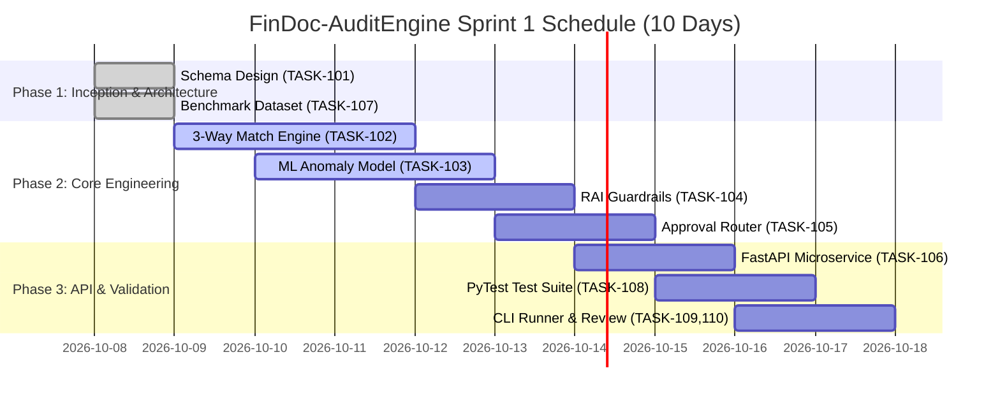
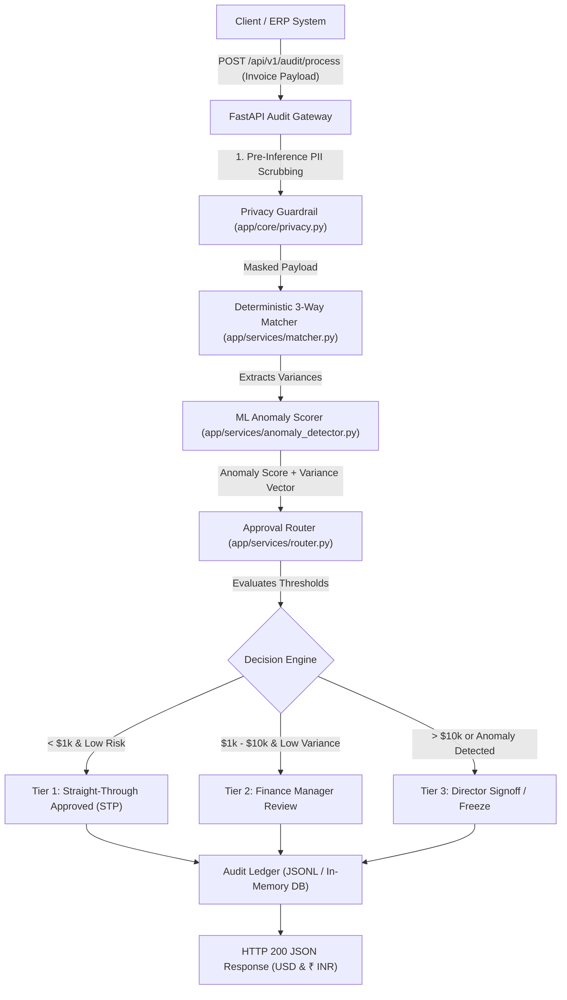

# Linkific Enterprise Agile Sprint Planning & Architecture Specification

**Project Title:** Linkific Enterprise Intelligent Financial Document Processing & Multi-Tier Audit Gateway (FinDoc-AuditEngine)  
**Track:** AI/ML Internship — Day 27  
**Organization:** Linkific Technology Solutions Pvt Ltd  
**Sprint Cycle:** Sprint 1 (Two-Week Iteration: 10 Working Days)  
**Sprint Goal:** Design, architect, estimate, and deploy a production-grade medium-level AI financial audit microservice featuring automatic PO matching, risk-scoring ML, PII guardrails, and dual currency (USD/INR) approval tiers.

---

## 1. Executive Summary & Problem Statement

Enterprises process thousands of invoices, receipts, and purchase orders monthly. Manual reconciliation between Purchase Orders (PO), Goods Receipt Notes (GRN), and vendor invoices creates processing bottlenecks, compliance risks, and delayed vendor disbursements. 

The **FinDoc-AuditEngine** is a medium-level AI/ML microservice built for Linkific that automates end-to-end invoice auditing:
1. **Intelligent Ingestion & Parsing:** Extracts structured financial data from raw invoice payloads.
2. **Deterministic 3-Way Reconciliation:** Mathematically verifies line-item prices, received quantities, and tax calculations against PO records.
3. **Machine Learning Risk & Anomaly Scoring:** Uses an Isolation Forest anomaly detection model to assign a dynamic risk score ($0-100$) based on vendor historical spend, quantity variance, price variance, and offshore payment signals.
4. **Responsible AI Guardrails:** Pre-inference PII masking (PAN, Aadhaar, Credit Card, Email) and post-inference numerical hallucination verification.
5. **Tiered Human-in-the-Loop (HITL) Routing:** Automatic Straight-Through Processing (STP) for low-risk invoices ($< \$1,000$ / $< ₹86,500$), Manager review for medium-risk ($\$1k-\$10k$), and Director signoff for high-value / anomalous invoices ($> \$10k$).

---

## 2. Team Roles & RACI Matrix

```
R = Responsible (Executes task)
A = Accountable (Approves & owns outcome)
C = Consulted (Provides two-way input)
I = Informed (Kept updated)
```

| Project Deliverable / Activity | Product Owner (PO) | Scrum Master (SM) | Lead AI/ML Engineer | Backend / FastAPI Engineer | QA & Test Engineer | DevOps / Platform Engineer |
|---|:---:|:---:|:---:|:---:|:---:|:---:|
| **Requirements & User Stories** | **A** / R | C | C | C | I | I |
| **Architecture & Schema Design** | C | I | **A** / R | R | C | C |
| **ML Anomaly & Risk Model** | I | I | **A** / R | C | C | I |
| **FastAPI Microservice Endpoints** | I | I | C | **A** / R | C | C |
| **Responsible AI Guardrails** | C | I | R | R | **A** | I |
| **Unit & Integration Test Suite** | I | I | C | C | **A** / R | I |
| **CI/CD & Docker Containerization** | I | C | I | C | C | **A** / R |
| **Sprint Review & Demo** | **A** | R | R | R | R | I |

---

## 3. Sprint Planning & Complexity Estimation

Estimation follows the Fibonacci Story Point scale combined with **Low / Medium / High** technical complexity:
- **Low Complexity (1–2 Story Points):** Standard CRUD, schema definition, configuration.
- **Medium Complexity (3–5 Story Points):** Algorithmic business logic, 3-way reconciliation engine, PII masking integration.
- **High Complexity (8 Story Points):** ML anomaly model training & inference calibration, multi-objective routing, end-to-end pipeline orchestration.

### Sprint 1 Task Breakdown:

| Task ID | User Story / Task Description | Complexity | Story Points | Priority | Dependencies | Assigned Role |
|---|---|:---:|:---:|:---:|---|---|
| **TASK-101** | Define Pydantic v2 schemas for Invoices, POs, Risk Scores, and Audit Decisions | **Low** | 2 SP | P0 (Critical) | None | AI/ML Engineer |
| **TASK-102** | Implement deterministic 3-way matching engine (Invoice vs PO vs GRN line-items) | **Medium** | 3 SP | P0 (Critical) | TASK-101 | Backend Engineer |
| **TASK-103** | Train & calibrate ML Anomaly Detection model (Isolation Forest on financial vectors) | **High** | 5 SP | P0 (Critical) | TASK-101 | AI/ML Engineer |
| **TASK-104** | Integrate Responsible AI Guardrail Gateway (PII scrubbing + Number verifier) | **Medium** | 3 SP | P1 (High) | TASK-101 | AI/ML Engineer |
| **TASK-105** | Build multi-tier approval router with dual currency support (USD & INR at ₹86.50) | **Medium** | 3 SP | P0 (Critical) | TASK-102, TASK-103 | Backend Engineer |
| **TASK-106** | Develop FastAPI REST API with `/audit/process`, `/audit/health`, `/audit/history` | **Medium** | 5 SP | P0 (Critical) | TASK-102 to 105 | Backend Engineer |
| **TASK-107** | Build synthetic enterprise benchmark dataset (25 realistic ground-truth test cases) | **Low** | 2 SP | P1 (High) | TASK-101 | QA Engineer |
| **TASK-108** | Implement comprehensive PyTest validation suite & cross-day regressions | **Medium** | 3 SP | P0 (Critical) | TASK-106, TASK-107 | QA Engineer |
| **TASK-109** | Build interactive CLI runner (`run_project.py`) with formatted terminal tables | **Low** | 2 SP | P2 (Medium) | TASK-106 | AI/ML Engineer |
| **TASK-110** | Sprint review documentation, README, and production readiness audit | **Low** | 2 SP | P1 (High) | All Tasks | Scrum Master / Team |

**Total Sprint Velocity:** **30 Story Points** across 10 working days.

---

## 4. Task Priority Table

Tasks are prioritized using the **MoSCoW Framework** (Must-Have, Should-Have, Could-Have, Won't-Have):

| Priority Tier | Task IDs | Business Justification & Risk Assessment |
|---|---|---|
| **Must-Have (P0)** | TASK-101, TASK-102, TASK-103, TASK-105, TASK-106, TASK-108 | Core minimum viable product (MVP). Without 3-way matching, ML risk scoring, and API routing, automated financial auditing cannot function. |
| **Should-Have (P1)**| TASK-104, TASK-107, TASK-110 | Essential for production compliance (Responsible AI PII safety, EEOC fairness, comprehensive test datasets, documentation). |
| **Could-Have (P2)** | TASK-109 | Interactive CLI runner for developer inspection and executive demonstrations. |
| **Won't-Have (P3)** | Distributed Kafka Streaming (Deferred to Sprint 2) | Streaming queue integration deferred until core audit gateway is stabilized. |

---

## 5. Project Timeline & Gantt Schedule



---

## 6. Architecture Design & Data Flow


