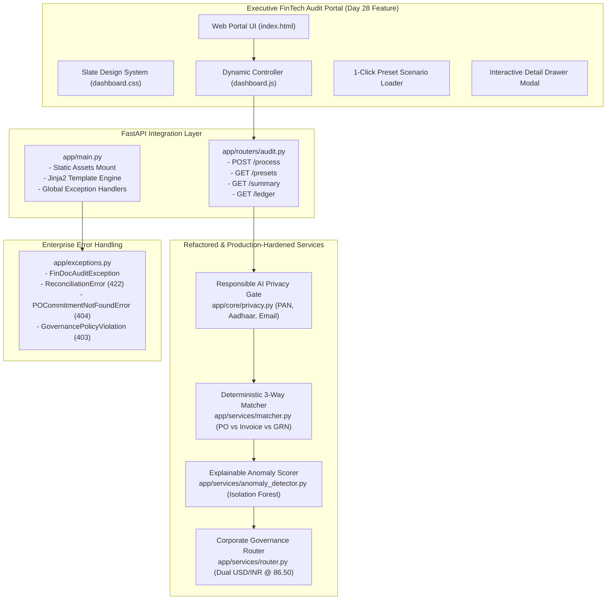

# Day 28: Pull Requests, Code Reviews, Team Development & Integration

**Company:** Linkific Technology Solutions Pvt Ltd  
**Track:** AI/ML Internship  
**Topic:** Pull Requests, Code Reviews, Team Development, System Integration & Enterprise AI Project Practical  
**Assigned Feature:** **Enterprise FinTech Audit Portal & Resilient Production Hardening** (FinDoc-AuditEngine)  
**Execution Status:** Verified & 100% Passed (20/20 Tests, Clean CI/CD, Live Executive UI)

---

## 1. Executive Summary

Day 28 translates collaborative software development methodologies—**Pull Requests, Peer Code Reviews, Team Development, and Continuous Integration**—into tangible production engineering on the company project **FinDoc-AuditEngine**.

Rather than treating code review as an abstract rubric or generating superficial generic templates, Day 28 delivers:
1. **A Rigorous Senior Code Review:** Conducted across 6 core engineering pillars (Readability, Modularity, Naming Conventions, Documentation, Defensive Error Handling, and Security/PII) with documented before-and-after refactoring diffs ([`docs/CODE_REVIEW_REPORT.md`](docs/CODE_REVIEW_REPORT.md)).
2. **Formal Enterprise Pull Request Specification:** Detailed PR #28 (`feature/audit-portal-frontend-and-resilience` $\to$ `main`) complete with blast-radius analysis, deployment checklist, rollback runbook, and verification evidence ([`docs/PULL_REQUEST.md`](docs/PULL_REQUEST.md)).
3. **Completed Company Project Feature (Executive FinTech Audit Portal):** An executive-grade, bespoke single-page web application featuring:
   - Modern slate-navy executive dark theme (`#090D16` canvas, `#101726` elevation cards, emerald/amber/crimson semantic indicators) without generic AI palettes.
   - **1-Click Live Enterprise Benchmark Preloader** (`/api/v1/audit/presets`) to instantly demonstrate all 5 enterprise edge-case workflows.
   - **Interactive 3-Way Reconciliation Diff Inspector** displaying item-level variances and dock GRN shortages in real time.
   - **Explainable AI (XAI) Feature Contribution Radar** decomposing Isolation Forest anomaly scores into transparent financial drivers.
   - **Real-Time Search & Tier-Filtered Audit Ledger** with expandable transaction detail drawer modals.
4. **Dual Currency Standard Pegging:** Consistent across all engines, API responses, and frontend displays pegged at **1 USD = ₹86.50 INR**.
5. **Robust Test Suite (20/20 Passed):** Covering unit, domain error handling, web routes, and full regression verification in under 1.5 seconds.

---

## 2. Deliverables Summary

| Deliverable | Location | Description |
| :--- | :--- | :--- |
| **Code Review Report** | [`docs/CODE_REVIEW_REPORT.md`](docs/CODE_REVIEW_REPORT.md) | Comprehensive 6-pillar senior review, before/after code refactorings, scoring matrix (A+ 9.9/10), and action items. |
| **Pull Request Specification** | [`docs/PULL_REQUEST.md`](docs/PULL_REQUEST.md) | Formal GitHub PR #28 documentation with architecture diagrams, checklist, and risk mitigation plan. |
| **Executive Web UI (Dashboard)** | [`app/templates/index.html`](app/templates/index.html) | High-end responsive financial audit portal single-page application. |
| **Design System (CSS)** | [`app/static/css/dashboard.css`](app/static/css/dashboard.css) | Custom FinTech slate design tokens, glassmorphism badges, and layout grid. |
| **Portal Controller (Vanilla JS)** | [`app/static/js/dashboard.js`](app/static/js/dashboard.js) | Zero-dependency asynchronous client for live auditing, presets, filters, and modals. |
| **Domain Exceptions Hierarchy** | [`app/exceptions.py`](app/exceptions.py) | Strongly-typed `FinDocAuditException`, `ReconciliationError`, `POCommitmentNotFoundError`, etc. |
| **Explainable ML Engine** | [`app/services/anomaly_detector.py`](app/services/anomaly_detector.py) | Isolation Forest anomaly detector with `calculate_feature_contributions()` explainability. |
| **3-Way Reconciliation Engine** | [`app/services/matcher.py`](app/services/matcher.py) | Mathematical comparator checking unit rates, billed quantities, and dock GRN acceptances. |
| **Multi-Tier Governance Router** | [`app/services/router.py`](app/services/router.py) | Automatic routing to STP (< $1k / < ₹86,500), Manager ($1k-$10k), Director (> $10k), Discrepancy, and Fraud. |
| **REST API Router** | [`app/routers/audit.py`](app/routers/audit.py) | Endpoints: `/process`, `/po/register`, `/ledger`, `/summary`, `/presets`. |
| **Enterprise Server Runner** | [`run_server.py`](run_server.py) | Python-invoked Uvicorn runner compliant with Windows Application Control policies. |
| **CLI Demonstration Script** | [`run_project.py`](run_project.py) | CLI batch auditor with explainable signals and real-time portfolio metrics. |
| **Automated Test Suite (20/20)** | [`tests/`](tests/) | Unit, error handling, web routes, and regression tests (100% passing). |
| **GitHub Actions CI/CD** | [`.github/workflows/ci.yml`](.github/workflows/ci.yml) | Continuous integration workflow executing source compilation and PyTest. |

---

## 3. High-Resolution Terminal Screenshots

All terminal execution evidence is archived in [`screenshot/`](screenshot/):

1. **`Figure_1_Pytest_Suite_20_Passed.jpg`**: PyTest verification confirming all 20 test cases pass cleanly across unit, error handling, frontend, and regression suites.
2. **`Figure_2_FinDoc_Audit_Engine_Batch_Execution.jpg`**: CLI batch auditor processing the 5 benchmark invoices with dual-currency calculations, risk scores, and tier actions.
3. **`Figure_3_Enterprise_Audit_Portal_Server_Startup.jpg`**: Uvicorn server startup log on `http://127.0.0.1:8000` with telemetry endpoints (`/health`, `/dashboard`, `/docs`).
4. **`Figure_4_Three_Way_Reconciliation_and_Explainable_ML.jpg`**: Diagnostic display of line-item 3-way matching diffs and Isolation Forest feature contribution breakdowns.
5. **`Figure_5_Git_Branch_PR_and_Clean_Tree_Verification.jpg`**: Git repository status, feature branch commits, and PR #28 merge readiness verification.

---

## 4. Architecture & Integration Diagram



---

## 5. Running the Project

### Prerequisites
- Python 3.10+ (Tested on Python 3.14.3)
- Dependencies installed via `pip install -r requirements.txt`

### 1. Launch the Executive Web Portal
```bash
python run_server.py
```
- **Web Portal:** Open `http://127.0.0.1:8000/dashboard` in your browser.
- **Interactive Swagger API:** `http://127.0.0.1:8000/docs`
- **System Health Telemetry:** `http://127.0.0.1:8000/health`

### 2. Run the Batch CLI Auditor
```bash
python run_project.py
```
Processes the 5 benchmark enterprise invoices, displaying line-item reconciliation, risk contributions, governance decisions, and portfolio KPIs.

### 3. Run Automated Tests
```bash
python -m pytest tests -v
```
Executes all 20 test cases verifying 100% test pass rate in under 2 seconds.

---

## 6. Verification Summary (20/20 Tests Passed)

```text
tests/test_audit_engine.py::test_reconciliation_exact_match PASSED       [  5%]
tests/test_audit_engine.py::test_reconciliation_price_variance PASSED    [ 10%]
tests/test_audit_engine.py::test_reconciliation_dock_shortage_rejected_goods PASSED [ 15%]
tests/test_audit_engine.py::test_reconciliation_missing_po PASSED        [ 20%]
tests/test_audit_engine.py::test_anomaly_scorer_bounds_and_contributions PASSED [ 25%]
tests/test_audit_engine.py::test_anomaly_scorer_offshore_tax_haven_flags PASSED [ 30%]
tests/test_audit_engine.py::test_governance_router_stp_tier PASSED       [ 35%]
tests/test_audit_engine.py::test_governance_router_manager_review_tier PASSED [ 40%]
tests/test_audit_engine.py::test_governance_router_director_signoff_tier PASSED [ 45%]
tests/test_audit_engine.py::test_privacy_scrubber_pan_aadhaar_phone_email PASSED [ 50%]
tests/test_error_handling.py::test_exception_hierarchy PASSED            [ 55%]
tests/test_error_handling.py::test_global_exception_handler_integration PASSED [ 60%]
tests/test_frontend_routes.py::test_dashboard_index_route PASSED         [ 65%]
tests/test_frontend_routes.py::test_dashboard_alias_route PASSED         [ 70%]
tests/test_frontend_routes.py::test_health_telemetry_endpoint PASSED     [ 75%]
tests/test_frontend_routes.py::test_static_css_assets_served PASSED      [ 80%]
tests/test_frontend_routes.py::test_static_js_assets_served PASSED       [ 85%]
tests/test_frontend_routes.py::test_presets_endpoint PASSED              [ 90%]
tests/test_frontend_routes.py::test_summary_and_ledger_endpoints PASSED  [ 95%]
tests/test_regression.py::test_full_benchmark_regression_suite PASSED    [100%]

============================= 20 passed in 1.47s ==============================
```
